# CoalMind AI

**Intelligent Geological, Mining & Reporting Platform for CMPDI / Coal India Limited**
Smart India Hackathon 2026 · Problem Statement **SIH 26023** · Ministry of Coal


-orange)


CoalMind AI ingests decades of heterogeneous mining documents (scanned PDFs, digital
PDFs, images, plain text), extracts structured facts with **per-field confidence
scoring** and `{document, page, bounding box}` traceability, folds the accepted facts
into a **typed, temporally-valid domain knowledge graph**, and lets officers generate
**cited, parliament-ready reports** or ask **natural-language questions** — where every
figure in an answer or report links back to its source, and low-confidence values are
routed to a human before they can be used.

> **Design bet (verified throughout the code):** in a government-accountability context
> an untraceable AI answer is worse than no answer. Auditable extraction first,
> generative convenience second; humans verify low-confidence facts; an on-prem
> open-weight LLM is the default and the platform degrades gracefully when it is
> unavailable.

---

## Table of Contents

1. [Project Overview](#1-project-overview)
2. [Complete System Architecture](#2-complete-system-architecture)
3. [Technology Stack](#3-technology-stack)
4. [Project Structure](#4-project-structure)
5. [System Components](#5-system-components)
6. [Data Flow Architecture](#6-data-flow-architecture)
7. [Complete Application Flow](#7-complete-application-flow)
8. [User Flows](#8-user-flows)
9. [Use Case Diagrams](#9-use-case-diagrams)
10. [API Architecture](#10-api-architecture)
11. [Database Architecture](#11-database-architecture)
12. [Authentication & Authorization](#12-authentication--authorization)
13. [External Integrations](#13-external-integrations)
14. [AI / ML Architecture](#14-ai--ml-architecture)
15. [Background Processing & Jobs](#15-background-processing--jobs)
16. [Error Handling Flow](#16-error-handling-flow)
17. [Security Architecture](#17-security-architecture)
18. [Deployment Architecture](#18-deployment-architecture)
19. [Installation Guide](#19-installation-guide)
20. [Environment Variables](#20-environment-variables)
21. [Configuration Flow](#21-configuration-flow)
22. [Feature Documentation](#22-feature-documentation)
23. [Testing Architecture](#23-testing-architecture)
24. [Development Workflow](#24-development-workflow)
25. [Troubleshooting](#25-troubleshooting)
26. [Limitations & Known Issues](#26-limitations--known-issues)
27. [Roadmap](#27-roadmap)
28. [Contributing Guide](#28-contributing-guide)
29. [Complete System Summary](#29-complete-system-summary)

---

## 1. Project Overview

### What it is

CoalMind AI is a **document-intelligence and knowledge-management platform** purpose-built
for CMPDI (Central Mine Planning & Design Institute) and Coal India Limited's subsidiaries
(BCCL, CCL, ECL, MCL, NCL, SECL, WCL, NEC). It turns unstructured mining archives into a
queryable, auditable knowledge base.

### The problem it solves

When the Ministry of Coal or Parliament asks a question, officers currently dig manually
through scanned PDFs, production registers, exploration data and correspondence to compile
an answer — slow, inconsistent, and dependent on which officer knows where the data lives.
CoalMind automates ingestion, extraction, validation, reporting and Q&A while keeping a
human in the loop for anything the model is not confident about.

### Target users (personas, from `docs/PRD.md` §5)

| Persona | Platform role | What they do in CoalMind |
|---|---|---|
| CMPDI Reporting Officer | `reporting_officer` | Generate cited draft reports answering parliamentary/administrative questions |
| Subsidiary Geologist / Surveyor | `geologist` | Semantic + graph search across historical geological data, scoped to their subsidiary |
| Ministry of Coal Official | `ministry_official` | Cross-subsidiary view of topics, trends, anomalies, and the admin overview |
| CIL Data / IT Admin | `data_admin` | Ingestion monitoring, RBAC / user management, audit-log inspection, chain verification |
| Field / Records Clerk | `records_clerk` | Bulk-upload legacy archives, verify low-confidence extractions |

### Core capabilities (all implemented — see [§22](#22-feature-documentation))

- **Ingestion & extraction pipeline** — upload → SHA-256 dedupe → classify → digital-text
  or OCR extraction → rule + NER field extraction with per-field confidence and
  `{page, bbox, snippet}` provenance → threshold routing to a **human review queue**.
- **Domain knowledge graph** — accepted extractions resolve into `kg_entity` / `kg_relation`
  (typed, temporally valid, full provenance) plus a `pgvector` index over document chunks.
- **Report generation** — 4 templates bind the graph + live field status; every figure is
  cited; low-confidence figures block finalisation; append-only version history separates
  AI vs human edits; PDF / DOCX / HTML export.
- **Graph-aware RAG Q&A** — entity→fact retrieval + vector passages, role-scoped,
  extractive-first, **declines rather than guesses** when evidence is weak, search-only if
  the LLM is down, and caches officer-verified answers.
- **Topics & word cloud** — NMF topic modelling with multilingual term normalisation,
  filterable word cloud, trend-over-time, and an LLM one-paragraph synthesis per topic.
- **Anomaly detection** — cross-document comparison of graph facts flags inconsistencies
  between historical and new data (revision / contradiction / sum mismatch / out-of-range
  / trend break), each traceable to source.
- **Security & admin** — bcrypt + JWT auth, per-subsidiary row scoping, hash-chained audit
  trail with tamper detection, admin console.
- **Hindi / bilingual support** — `eng+hin` OCR with automatic fallback, Devanagari +
  roman-Hindi classifier keywords, answers returned in the question's language.

### High-level technology overview

FastAPI + SQLAlchemy 2 + Alembic backend (Python 3.12, `uv`-managed) · PostgreSQL 16 with
`pgvector` + `pg_trgm` · MinIO object storage · Ollama (on-prem LLM, default) with
Anthropic / OpenRouter fallbacks behind one interface · fastembed (`bge-small-en-v1.5`)
for on-prem embeddings · React 18 + Vite 6 + TypeScript + Tailwind 3 + TanStack Query
frontend · Docker Compose for local infra.

---

## 2. Complete System Architecture

This is the whole platform as built. Boxes are packages/modules that exist in the
repository; arrows are real call/data paths.

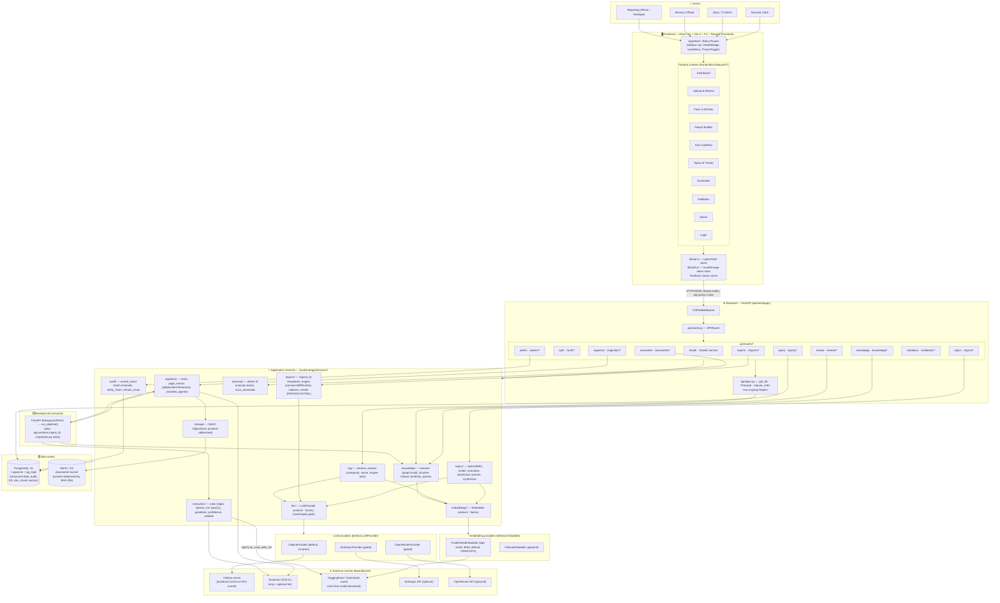

**Layered view** (mirrors `docs/architecture.md`):

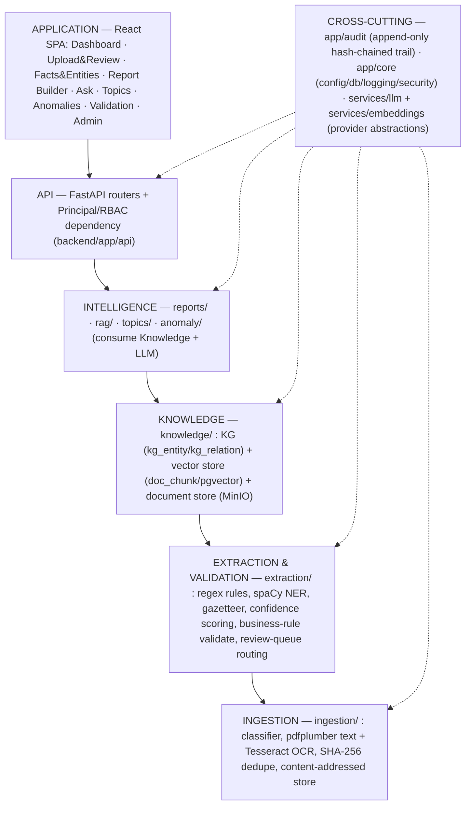

---

## 3. Technology Stack

Only technologies actually present in `backend/pyproject.toml`, `frontend/package.json`,
`docker-compose.yml` and the code are listed.

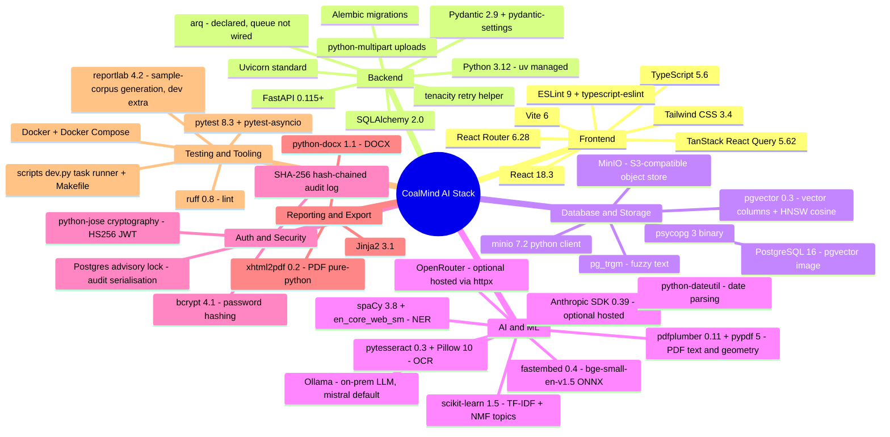

| Layer | Technology | Where |
|---|---|---|
| Frontend framework | React 18 + Vite 6 + TypeScript | `frontend/` |
| Styling | Tailwind CSS 3 + CSS custom-property tokens, light/dark toggle | `frontend/src/styles/index.css`, `tailwind.config.js` |
| Data fetching | TanStack Query 5, typed `fetch` wrapper | `frontend/src/lib/api.ts` |
| Routing | React Router 6 (`createBrowserRouter`) | `frontend/src/app/router.tsx` |
| API framework | FastAPI + Uvicorn | `backend/app/main.py` |
| ORM / migrations | SQLAlchemy 2 (sync engine) + Alembic | `backend/app/core/db.py`, `backend/alembic/` |
| Settings | pydantic-settings (typed `Settings`) | `backend/app/core/config.py` |
| Relational DB | PostgreSQL 16 (`pgvector/pgvector:pg16`) | `docker-compose.yml` |
| Vector search | `pgvector` `Vector(384)` + `cosine_distance` | `backend/app/models/knowledge.py`, `query.py` |
| Object storage | MinIO (S3 API on `:9000`, console `:9001`) | `docker-compose.yml`, `backend/app/services/storage/` |
| LLM (default) | Ollama, model `mistral`, `keep_alive` | `backend/app/services/llm/ollama.py` |
| LLM (optional) | Anthropic (`claude-sonnet-5`), OpenRouter (`openai/gpt-4o-mini`) | `backend/app/services/llm/` |
| Embeddings | fastembed `BAAI/bge-small-en-v1.5` (384d) or Ollama | `backend/app/services/embeddings/` |
| OCR | Tesseract 5.x via `pytesseract`, `eng+hin` with fallback | `backend/app/services/ingestion/page_extract.py` |
| NER | spaCy `en_core_web_sm` + mining gazetteer | `backend/app/services/extraction/ner.py` |
| Topic modelling | scikit-learn TF-IDF + NMF (BERTopic path import-guarded, not installed) | `backend/app/services/topics/` |
| Auth | bcrypt + HS256 JWT (access/refresh) | `backend/app/core/security.py` |
| Reports export | Jinja2 + xhtml2pdf (PDF) + python-docx (DOCX) | `backend/app/services/reports/render.py` |
| Local infra | Docker Compose (Postgres, MinIO, one-shot bucket setup) | `docker-compose.yml` |
| CI/CD | **Not implemented** — no `.github/workflows`; noted as "Next" in project docs | — |
| Monitoring | `/health` per-dependency probe (memoised 5 s); structured logging; no APM/Prometheus | `backend/app/api/routes/health.py`, `backend/app/core/logging.py` |

---

## 4. Project Structure

```text
SIH26023/
├── backend/                         FastAPI + SQLAlchemy + Alembic (Python 3.12, uv)
│   ├── app/
│   │   ├── main.py                  App factory: CORS, router include, lifespan (model warmup)
│   │   ├── __init__.py              __version__ = "0.1.0"
│   │   ├── api/
│   │   │   ├── router.py            Top-level APIRouter — includes every feature router
│   │   │   ├── deps.py              get_db, Principal, get_principal, require_roles, row-scoping
│   │   │   └── routes/              One module per feature area (11 routers) — see §10
│   │   ├── core/
│   │   │   ├── config.py            Typed Settings (env-driven); the only place env is read
│   │   │   ├── db.py                Engine, SessionLocal, Base, get_db()
│   │   │   ├── security.py          bcrypt hashing + JWT issue/verify
│   │   │   └── logging.py           Structured logging config
│   │   ├── models/                  ORM tables (§11): document, knowledge, organization,
│   │   │                            report, query, topic, anomaly, audit, base mixins
│   │   ├── schemas/                 Pydantic request/response models per feature
│   │   ├── services/
│   │   │   ├── ingestion/           store (dedupe) · page_extract (pdfplumber/Tesseract) ·
│   │   │   │                        classifier (rule-based) · pipeline (orchestrator)
│   │   │   ├── extraction/          rules (regex Specs) · ner (spaCy) · gazetteer ·
│   │   │   │                        confidence · validate · locate (bbox/snippet) · types
│   │   │   ├── knowledge/           resolver (KG build) · chunker · indexer (embed) ·
│   │   │   │                        normalize · queries · build (orchestrator)
│   │   │   ├── rag/                 retrieve · answer (compose) · cache · engine (ask)
│   │   │   ├── reports/             registry · engine · citations · facts · narrative ·
│   │   │   │                        mdblocks · render · models · templates/ (4)
│   │   │   ├── topics/              build (NMF) · model · normalize · wordcloud ·
│   │   │   │                        queries · synthesize
│   │   │   ├── anomaly/             detect (5 kinds) · scan_anomalies
│   │   │   ├── llm/                 base (protocol) · factory (sovereignty gate) ·
│   │   │   │                        ollama · anthropic_provider · openrouter
│   │   │   ├── embeddings/          base · factory · fastembed_embedder · ollama_embedder
│   │   │   └── storage/             minio_client (content-addressed ObjectStore)
│   │   ├── audit/                   writer (record_event, hash-chained) · verify (verify_chain,
│   │   │                            rehash_chain)
│   │   └── workers/                 ingest_cli (batch ingestion / KG rebuild CLI)
│   ├── alembic/versions/            8 migrations (baseline → M7 anomaly) — see §11
│   ├── tests/                       ~17 pytest modules (~80 tests) — see §23
│   └── pyproject.toml               deps + ruff + pytest config
│
├── frontend/                        React + Vite + TypeScript + Tailwind SPA
│   ├── src/
│   │   ├── main.tsx                 React root + RouterProvider + QueryClient
│   │   ├── app/
│   │   │   ├── AppShell.tsx         Sidebar + top bar layout (Outlet)
│   │   │   ├── router.tsx           Route table (login + shell + feature routes)
│   │   │   └── nav.ts               NAV array (label, blurb, milestone, built flag)
│   │   ├── features/               One folder per screen (dashboard, ingestion, knowledge,
│   │   │                            reports, query, topics, anomalies, validation, admin, auth)
│   │   ├── components/             charts.tsx, layout.tsx, primitives.tsx, HealthBadge,
│   │   │                            ThemeToggle, UserMenu
│   │   └── lib/                    api.ts (typed client) · auth.ts (token store) ·
│   │                               types.ts · labels.ts
│   ├── vite.config.ts               dev proxy /api → 127.0.0.1:8000, @ alias
│   └── package.json
│
├── docs/                            PRD.md · architecture.md · entity-schema.md
├── .planning/                       gsd-core artifacts: PROJECT / ROADMAP / CONTEXT
├── ml/
│   └── sample_corpus/               Synthetic CIL-style docs + ground_truth/*.json answer keys
│                                    (PDFs are .gitignore'd — regenerate with scripts/dev.py corpus)
├── scripts/
│   ├── dev.py                       Cross-platform task runner (up/migrate/seed/api/web/…)
│   ├── seed_db.py                   Seed 9 subsidiaries + 5 demo users (idempotent)
│   ├── gen_sample_corpus.py         Generate synthetic corpus + ground truth (reportlab)
│   ├── eval_extraction.py           DB-free extraction-accuracy benchmark vs ground truth
│   ├── perf_bench.py                Latency bench + in-process concurrent load test vs PRD NFRs
│   └── reset_demo.py                Clean the demo DB back to a presentable state
├── infra/
│   └── postgres/init/01-extensions.sql   CREATE EXTENSION vector, pg_trgm (first boot)
├── docker-compose.yml               Postgres 16 + pgvector, MinIO, minio-setup (bucket)
├── Makefile                         make wrappers around scripts/dev.py (Linux/macOS/WSL)
├── .env.example                     Documented settings template (copy to .env)
└── README.md                        This file
```

**Module relationship map:**

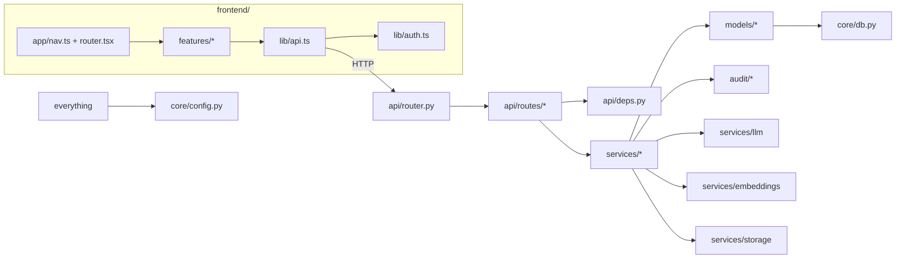

---

## 5. System Components

### 5.1 Ingestion service — `app/services/ingestion/`

| Aspect | Detail |
|---|---|
| Purpose | Persist uploaded documents and turn bytes into classified, geometry-aware pages |
| Responsibilities | SHA-256 dedupe + content-addressed MinIO storage (`store.ingest_bytes`); per-page text/word extraction with bounding boxes (`page_extract.extract_pages`); rule-based doc-type/language/date classification (`classifier.classify`); pipeline orchestration (`pipeline.run_pipeline`) |
| Inputs | `UploadFile` bytes + filename + content-type; a `Document` row id (for the pipeline) |
| Outputs | `Document` row (status lifecycle), `ExtractionField` rows, `document.meta.pipeline` stats, audit events |
| Dependencies | `services/storage` (MinIO), `services/extraction`, `services/knowledge`, Tesseract, pdfplumber |
| Connected to | `routes/ingestion.py`, `workers/ingest_cli.py`, `scripts/dev.py ingest-samples` |

### 5.2 Extraction & validation — `app/services/extraction/`

| Aspect | Detail |
|---|---|
| Purpose | Extract structured field candidates from classified pages, score confidence, validate |
| Responsibilities | Table-driven regex `Spec`s per doc type (`rules.py`); spaCy NER + mining gazetteer for supplemental `mention_*` candidates (`ner.py`, `gazetteer.py`); confidence scoring with OCR penalty and ≤0.97 cap (`confidence.py`); business-rule cross-checks (`validate.py`); bbox/snippet location (`locate.py`) |
| Inputs | `doc_type`, `list[Page]` |
| Outputs | `list[FieldCandidate]` (`field_key`, `value_text`, `value_json`, `entity_type`, `page_no`, `bbox`, `source_snippet`, `confidence`, notes) + document-level validation notes |
| Dependencies | spaCy `en_core_web_sm`, `python-dateutil` |
| Connected to | `ingestion/pipeline.py` |

### 5.3 Knowledge layer — `app/services/knowledge/`

| Aspect | Detail |
|---|---|
| Purpose | Turn **accepted** extraction fields into a typed temporal graph + a vector index |
| Responsibilities | Entity resolution / get-or-create + fact-node + relation building (`resolver.resolve_document`); sentence-aware overlapping chunking (`chunker.py`); embed + upsert `doc_chunk` (`indexer.index_document`); read primitives — stats, entity search, neighbors, `vector_search` (`queries.py`); name normalisation (`normalize.py`); orchestration (`build.build_knowledge`) |
| Inputs | A `Document` id; its accepted `ExtractionField` rows; optionally pre-parsed `Page`s |
| Outputs | `KGEntity` / `KGRelation` rows (provenance FKs to field + document), `DocChunk` rows with 384-d vectors, stats dict, audit event `knowledge.built` |
| Dependencies | `services/embeddings`, pgvector |
| Connected to | `ingestion/pipeline.py` (build after extraction), `routes/review.py` (rebuild after a verify/correct/reject), `routes/knowledge.py` (browsing), `services/rag` |

### 5.4 RAG query engine — `app/services/rag/`

| Aspect | Detail |
|---|---|
| Purpose | Answer natural-language questions with cited, extractive-first responses |
| Responsibilities | Verified-answer cache lookup by embedding cosine ≥ 0.90 (`cache.lookup_cached`); graph-fact + vector-passage retrieval, distinctive-token entity matching (`retrieve.py`); answer composition with evidence floor, INSUFFICIENT decline, search-only fallback, deterministic mode (`answer.compose_answer`); persist `QAPair`, promote/reject (`engine.ask`, `cache.promote_answer`) |
| Inputs | Question string, optional `subsidiary_id` scope, `use_cache` flag, principal |
| Outputs | `QAPair` row (`answer_md`, `citations[]`, `evidence[]`, `confidence`, `status`, `answer_mode`) + audit events (`query.answered` / `query.declined` / `query.cache_hit` / `query.verified` / `query.rejected`) |
| Dependencies | `services/knowledge` (retrieval), `services/embeddings`, `services/llm` |
| Connected to | `routes/query.py`, `AskPage` |

### 5.5 Report engine — `app/services/reports/`

| Aspect | Detail |
|---|---|
| Purpose | Generate cited, confidence-gated, version-controlled report drafts |
| Responsibilities | 4-template registry (`registry.py`); build drafts binding KG structure + live `ExtractionField` values with a `CitationCollector`; lifecycle create → rerender → human edit → finalise with an append-only `report_version` chain and AI-vs-human diff (`engine.py`); markdown↔blocks (`mdblocks.py`); PDF/DOCX/HTML render (`render.py`); LLM narrative with deterministic fallback (`narrative.py`) |
| Inputs | `template_key`, officer `params`, optional title/subsidiary |
| Outputs | `Report` + `ReportVersion` rows (`blocks`, `content_md`, `citations`, `unresolved`), exported bytes, audit events (`report.created` / `rerendered` / `edited` / `finalized`) |
| Dependencies | `services/knowledge`, `services/llm`, Jinja2, xhtml2pdf, python-docx |
| Connected to | `routes/reports.py`, `ReportsPage` |

### 5.6 Topics engine — `app/services/topics/`

| Aspect | Detail |
|---|---|
| Purpose | Surface emerging themes across the corpus with a word cloud and trend view |
| Responsibilities | Corpus assembly from `doc_chunk` text (`build._corpus`); NMF over TF-IDF, `n_topics` configurable, BERTopic path import-guarded (`model.fit_topics`); multilingual term normalisation + domain stoplist (`normalize.py`); word-frequency aggregation with filters (`wordcloud.py`); trend-over-time buckets and topic/document queries (`queries.py`); lazy LLM one-paragraph synthesis per topic (`synthesize.py`) |
| Inputs | Indexed `doc_chunk` rows; filter params (subsidiary / doc_type / since); `n_topics`, `engine` |
| Outputs | `Topic` + `TopicDoc` rows (latest `run_id` served), word-cloud items, trend series, audit event `topics.rebuilt` |
| Dependencies | scikit-learn, `services/llm` (synthesis only) |
| Connected to | `routes/topics.py`, `TopicsPage` |

### 5.7 Anomaly detector — `app/services/anomaly/`

| Aspect | Detail |
|---|---|
| Purpose | Flag inconsistencies between historical and new data for the same entity (FR-14) |
| Responsibilities | Group KG fact nodes by `(anchor entity, category/metric)`; detect `revision`, `contradiction`, `sum_mismatch`, `out_of_range`, `trend_break` with 2% / 0.01 tolerance (`detect._detect`); idempotent upsert by stable `signature`, auto-resolve stale rows, audit `anomaly.scan` (`detect.scan_anomalies`) |
| Inputs | The whole knowledge graph (reserve + production fact nodes) |
| Outputs | `Anomaly` rows (`kind`, `severity`, `status`, `title`, `detail`, `evidence[]` with `{document, page, field, value, as_on}`), scan stats dict |
| Dependencies | `services/knowledge` models |
| Connected to | `routes/anomalies.py`, `scripts/dev.py anomalies`, `AnomaliesPage`, `DashboardPage` |

### 5.8 Cross-cutting

| Component | Purpose | Key API |
|---|---|---|
| `app/audit/` | The only writer of the append-only, SHA-256 hash-chained `audit_event` trail; joins the caller's transaction; a Postgres advisory lock serialises concurrent appends; `verify_chain` / `rehash_chain` | `record_event(db, actor, action, target_type, target_id, meta)` |
| `app/services/llm/` | `LLMProvider` protocol (`health`, `complete`, `chat`); `get_llm()` factory enforces the sovereignty gate | `get_llm()` |
| `app/services/embeddings/` | `Embedder` protocol (`embed`, `embed_one`, `health`); `FastEmbedEmbedder` is a thread-safe singleton with capped ONNX threads + an inference lock + a 2048-entry LRU | `get_embedder()` |
| `app/services/storage/` | Content-addressed MinIO wrapper — `put_document` (dedupe by stat), `get_bytes`, `presigned_get`, `ensure_bucket`, `health` | `get_object_store()` |
| `app/core/config.py` | One typed `Settings` object; `@lru_cache`d `get_settings()` | `get_settings()` |

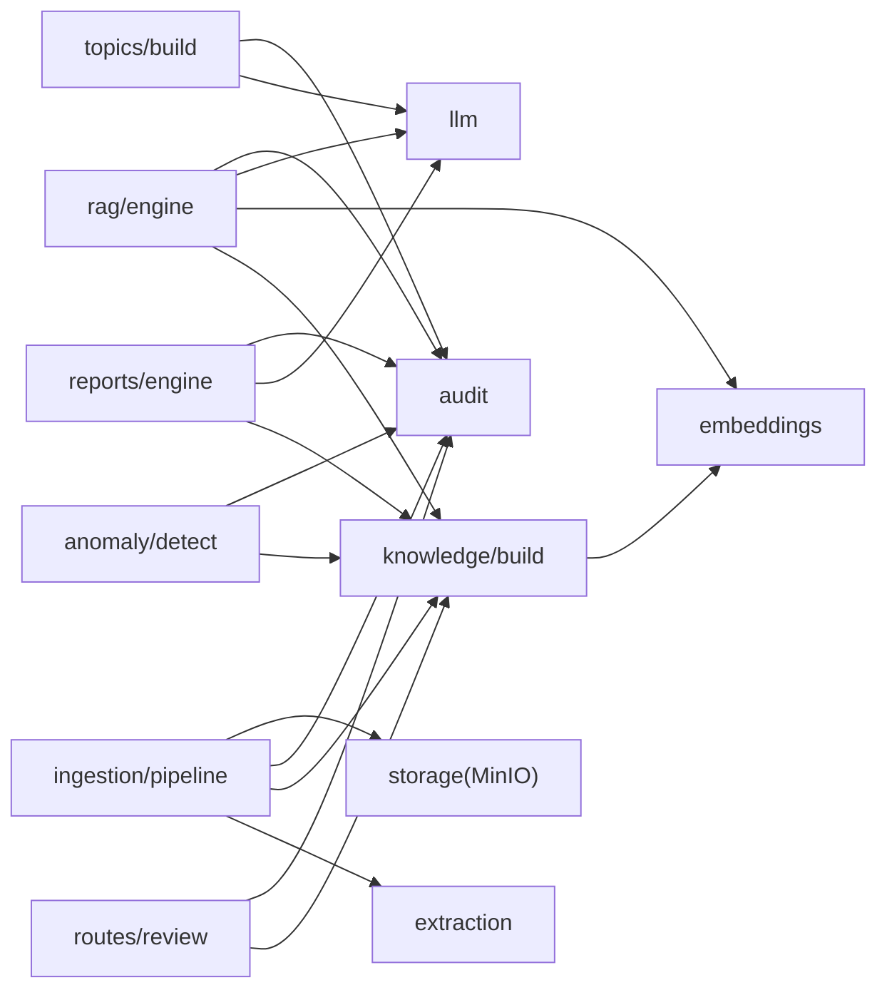

---

## 6. Data Flow Architecture

### 6.1 High-level

```mermaid
flowchart LR
    SRC["Source documents\nPDF · image · txt"] --> UP["Upload API\n/ingestion/documents"]
    UP --> DEDUP["SHA-256 dedupe\n+ MinIO store"]
    DEDUP --> PIPE["Pipeline (BackgroundTask)"]
    PIPE --> PARSE["page_extract\npdfplumber / Tesseract"]
    PARSE --> CLASS["classify\ndoc_type · language · date"]
    CLASS --> EXTR["extract_fields\nregex Specs + spaCy NER"]
    EXTR --> CONF["confidence.score\n+ validate"]
    CONF -->|>= threshold| AUTO["auto_accepted"]
    CONF -->|< threshold| REVQ["needs_review queue"]
    REVQ -->|officer confirm/correct| VERIF["verified"]
    AUTO --> KG["knowledge build\nkg_entity / kg_relation"]
    VERIF --> KG
    PARSE --> IDX["chunk + embed\ndoc_chunk (pgvector)"]
    KG --> API2["Knowledge / RAG / Reports / Topics / Anomaly APIs"]
    IDX --> API2
    API2 --> FE["Frontend screens"]
```

### 6.2 Ingestion → answerable knowledge (detailed)

```mermaid
sequenceDiagram
    autonumber
    participant U as User (browser)
    participant API as FastAPI /ingestion
    participant Store as MinIO
    participant DB as PostgreSQL
    participant BG as BackgroundTask run_pipeline
    participant PX as page_extract
    participant CL as classifier
    participant EX as extraction
    participant KN as knowledge/build
    participant EM as embeddings

    U->>API: POST /ingestion/documents (multipart files)
    API->>API: read bytes, size check (<= 40 MB)
    API->>DB: SELECT document WHERE sha256 = digest
    alt already ingested
        API-->>U: 201 {created: false}  (no reprocess)
    else new bytes
        API->>Store: put_document (content-addressed key)
        API->>DB: INSERT document(status=received) + audit document.ingested
        API->>BG: schedule run_pipeline(document_id)
        API-->>U: 201 {created: true, queued_for_processing: n}
    end
    BG->>DB: status = processing + audit
    BG->>Store: get_bytes(storage_key)
    BG->>PX: extract_pages(bytes)  (text layer or OCR fallback)
    BG->>CL: classify(full_text, filename)  -> doc_type, language, date
    BG->>EX: extract_fields(doc_type, pages) -> candidates + notes
    BG->>DB: replace ExtractionField rows; status = ready|needs_review|extracted
    BG->>DB: audit document.extracted
    BG->>KN: build_knowledge(doc_id, pages)
    KN->>DB: resolve accepted fields -> kg_entity / kg_relation
    KN->>EM: embed chunk texts
    KN->>DB: upsert doc_chunk(embedding) + audit knowledge.built
```

### 6.3 A cited answer

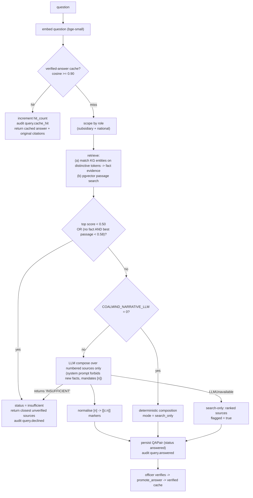

### 6.4 Report draft assembly

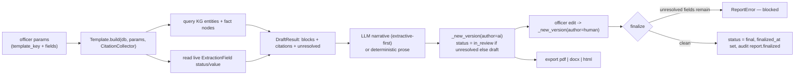

---

## 7. Complete Application Flow

End-to-end, from a click to a rendered UI update. Example: an officer asks a question.

```mermaid
sequenceDiagram
    autonumber
    actor Officer
    participant SPA as React SPA (AskPage)
    participant Q as TanStack Query
    participant Client as lib/api.ts
    participant Proxy as Vite /api proxy (dev)
    participant CORS as CORSMiddleware
    participant Route as routes/query.ask_question
    participant Deps as deps.get_principal
    participant DB as PostgreSQL
    participant RAG as services/rag.ask
    participant EMB as embeddings
    participant KG as knowledge/queries
    participant LLM as services/llm
    participant Audit as audit.record_event

    Officer->>SPA: type question, submit
    SPA->>Q: mutation(api.ask(question))
    Q->>Client: fetch POST /query {question, subsidiary_id}
    Client->>Client: attach Authorization: Bearer <token> if present
    Client->>Proxy: POST /api/query
    Proxy->>CORS: POST http://127.0.0.1:8000/query
    CORS->>Route: dispatch
    Route->>Deps: resolve Principal (token or dev data_admin)
    Deps->>DB: SELECT user by token sub (if bearer)
    Deps-->>Route: Principal(role, subsidiary_id, scoped)
    Route->>Route: enforce query scope vs principal.subsidiary_id
    Route->>RAG: ask(db, question, subsidiary_id, actor)
    RAG->>EMB: embed_one(question)
    RAG->>DB: cache lookup (verified QAPair, cosine)
    alt cache miss
        RAG->>KG: match_entities + fact evidence + vector_search
        RAG->>LLM: chat(system + numbered sources)  (unless deterministic / unavailable)
        RAG->>DB: INSERT QAPair(status answered|insufficient)
        RAG->>Audit: query.answered | query.declined
    else cache hit
        RAG->>DB: hit_count += 1 ; INSERT echo QAPair(answer_mode=cache)
        RAG->>Audit: query.cache_hit
    end
    RAG-->>Route: QAPair
    Route-->>Client: 200 AskResponse (answer_md, citations, evidence, confidence, from_cache)
    Client-->>Q: resolve
    Q-->>SPA: data
    SPA-->>Officer: render AnswerCard — prose + [n] citations + confidence + evidence trace
```

Generic request lifecycle for any endpoint:

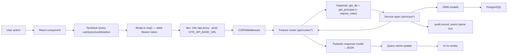

---

## 8. User Flows

### 8.1 Sign-in (optional in dev)

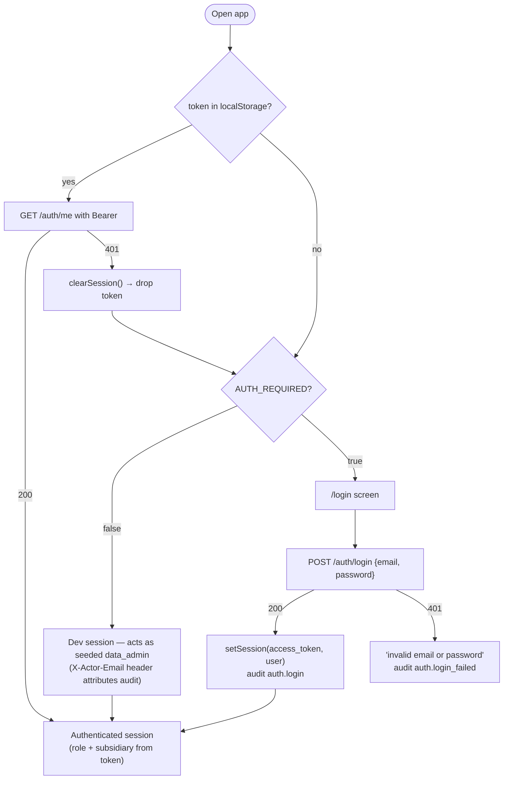

### 8.2 Ingestion & review (records clerk / data admin)

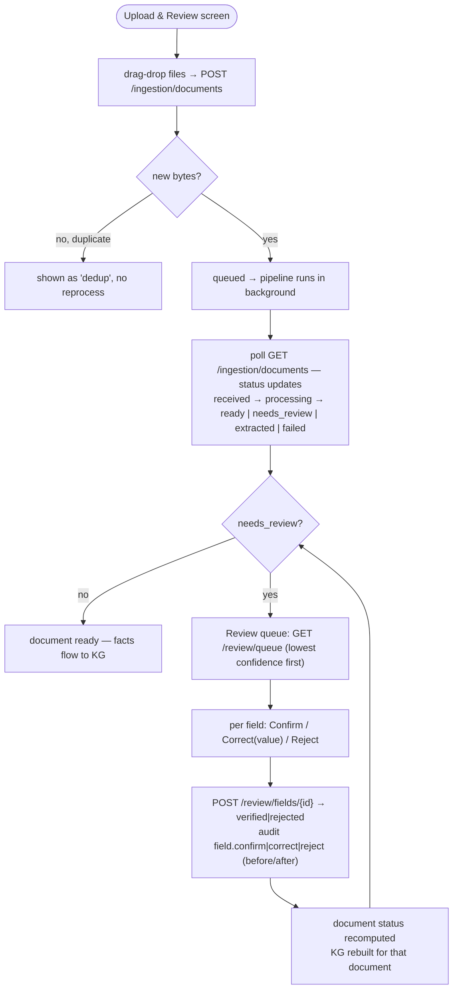

### 8.3 Ask CoalMind (officer)

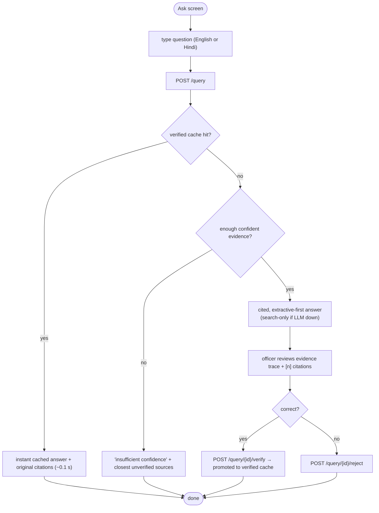

### 8.4 Report generation (reporting officer)

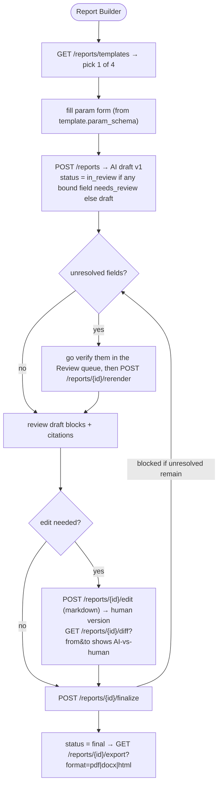

### 8.5 Topics & anomalies (ministry official)

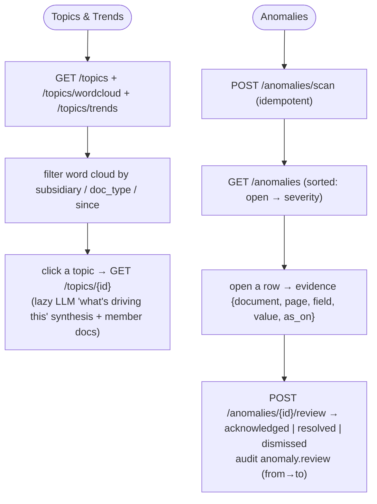

---

## 9. Use Case Diagrams

Actors and the capabilities each can reach. Role gating that is actually enforced in code
is noted; most read endpoints are open in dev (`AUTH_REQUIRED=false`) and row-scoped when a
scoped principal is authenticated.

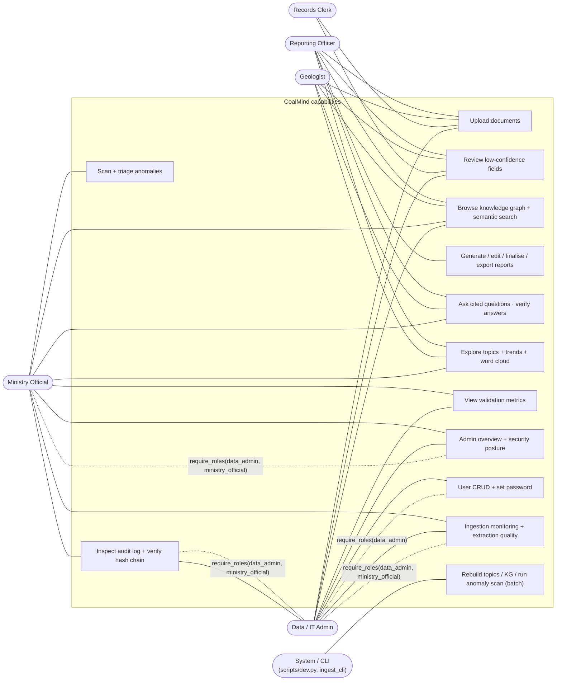

**External systems as actors:**

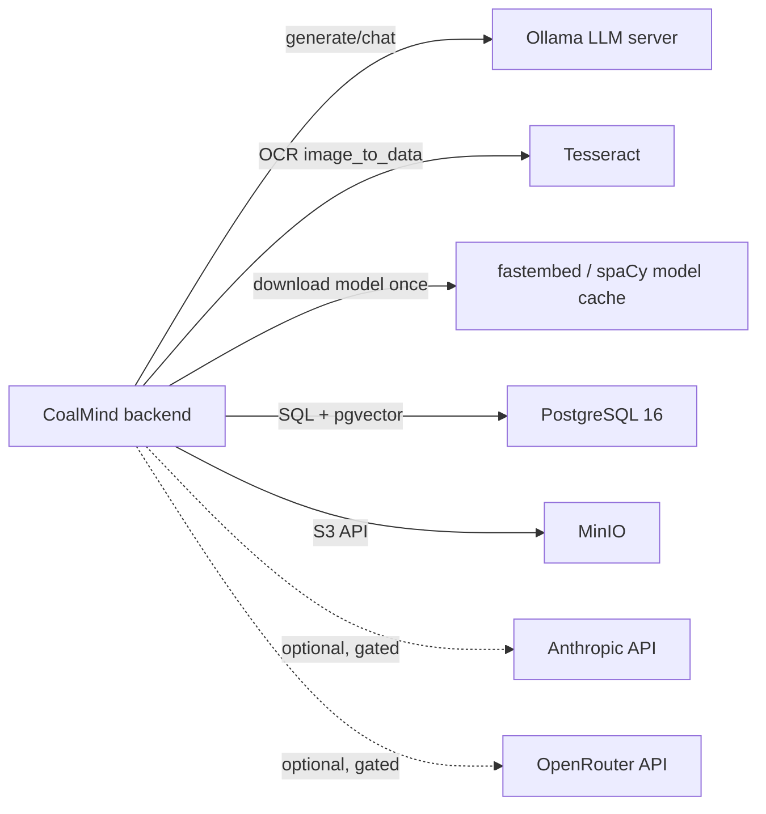

---

## 10. API Architecture

### Base URL & conventions

- **Dev:** the frontend calls same-origin `/api/*`; Vite proxies to `http://127.0.0.1:8000`
  (`frontend/vite.config.ts`).
- **Built deployment:** set `VITE_API_BASE_URL` to the backend origin (`frontend/src/lib/api.ts`).
- **Docs:** interactive OpenAPI at `http://localhost:8000/docs`; root `/` returns a service banner.
- **Auth:** `Authorization: Bearer <access_token>` when authenticated. Without a token and
  `AUTH_REQUIRED=false`, the request acts as the seeded `data_admin`; audit attribution can
  be supplied with the `X-Actor-Email` header on ingestion/review calls.
- **Errors:** FastAPI `HTTPException` → `{"detail": "..."}` with a conventional status code
  (see [§16](#16-error-handling-flow)).
- **CORS:** origins from `CORS_ORIGINS` (default `http://localhost:5173`), all methods/headers,
  credentials allowed.

### Request flow

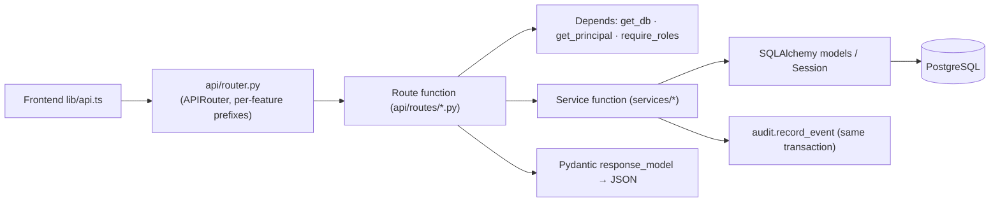

### Endpoint reference

All paths are relative to the backend origin. "Auth" = whether a role is enforced in code
(`require_roles`); everything else is open in dev and row-scoped for scoped principals.

#### Health — `api/routes/health.py`

| Method | Path | Description | Auth | Notes |
|---|---|---|---|---|
| GET | `/health` | Per-dependency probe (`db`, `storage`, `llm`, `embeddings`) | none | Always 200; `status` = `ok`/`degraded`; result memoised 5 s |
| GET | `/version` | Version + `llm_provider`, `embed_provider`, `allow_third_party_api` | none | |

#### Auth — `/auth` — `api/routes/auth.py`

| Method | Path | Body | Response | Notes |
|---|---|---|---|---|
| POST | `/auth/login` | `{email, password}` | `{access_token, refresh_token, user}` | bcrypt verify; audit `auth.login` / `auth.login_failed` |
| POST | `/auth/refresh` | `{refresh_token}` | `{access_token, refresh_token: null, user}` | rejects non-refresh tokens |
| GET | `/auth/me` | — | user + `is_authenticated`, `scoped` | synthesises a response for the unauthenticated dev session |

#### Ingestion — `/ingestion` — `api/routes/ingestion.py`

| Method | Path | Params / Body | Response | Notes |
|---|---|---|---|---|
| POST | `/ingestion/documents` | multipart `files[]`, `subsidiary_id?` (form) | `201 {items[], queued_for_processing}` | ≤ 40 MB/file; SHA-256 dedupe; schedules `run_pipeline` per new file |
| GET | `/ingestion/documents` | `status?`, `doc_type?`, `limit=50`, `offset=0` | `{items[], total}` | row-scoped for scoped principals |
| GET | `/ingestion/documents/{id}` | — | document + sorted `fields[]` | 404 if missing |
| GET | `/ingestion/documents/{id}/file` | — | `302` redirect to MinIO presigned URL | 15-min expiry |
| POST | `/ingestion/documents/{id}/reprocess` | — | `202` document | resets status, re-schedules pipeline |

#### Review — `/review` — `api/routes/review.py`

| Method | Path | Params / Body | Response | Notes |
|---|---|---|---|---|
| GET | `/review/queue` | `subsidiary_id?`, `doc_type?`, `limit=100`, `offset=0` | `{items[], total}` | `needs_review` fields, lowest confidence first; row-scoped |
| POST | `/review/fields/{id}` | `{action: confirm\|correct\|reject, value_text?, note?}` | `{id, status, value_text, document_id, document_status, reviewed_at}` | `correct` requires `value_text`; keeps `original_value_text`; audit `field.<action>` with before/after; rebuilds that document's KG |

#### Knowledge — `/knowledge` — `api/routes/knowledge.py`

| Method | Path | Params | Response | Notes |
|---|---|---|---|---|
| GET | `/knowledge/stats` | — | entity/relation counts by kind/predicate, chunk count | |
| GET | `/knowledge/entities` | `kind?`, `subsidiary_id?`, `q?`, `limit=100` | `{items[], total}` | name/`normalized_key` `ILIKE` |
| GET | `/knowledge/entities/{id}` | `as_of?` (ISO date) | entity + neighbors (predicate, direction, `valid_from`, `source_field_id`) | temporal edge filter |
| GET | `/knowledge/graph` | `limit=400` | `{entities[], relations[]}` | whole graph for the map view |
| GET | `/knowledge/documents/{id}/subgraph` | — | `{entities[], relations[]}` | that document's nodes/edges |
| GET | `/knowledge/search` | `q` (≥2), `k=8`, `subsidiary_id?` | `{query, hits[]}` | pgvector cosine over `doc_chunk` |

#### Reports — `/reports` — `api/routes/reports.py`

| Method | Path | Params / Body | Response | Notes |
|---|---|---|---|---|
| GET | `/reports/templates` | — | `[{key, title, description, param_schema}]` | 4 templates |
| GET | `/reports` | `status?`, `limit=50` | `{items[], total}` | |
| POST | `/reports` | `{template_key, params, title?, subsidiary_id?}` | `201` report detail | builds AI draft v1; `422` on unknown template / build error |
| GET | `/reports/{id}` | — | detail + `current_version` + `versions[]` | |
| GET | `/reports/{id}/versions/{version_no}` | — | full version | |
| POST | `/reports/{id}/rerender` | — | detail | AI re-render (facts refreshed); `409` if `final` |
| POST | `/reports/{id}/edit` | `{content_md, summary}` | detail | human version; `409` if `final` |
| POST | `/reports/{id}/finalize` | — | detail | `409` if any bound field still `needs_review` |
| GET | `/reports/{id}/diff` | `from`, `to` | `{from_, to, unified}` | unified diff of `content_md` |
| GET | `/reports/{id}/export` | `format=pdf\|docx\|html`, `version?` | file bytes | xhtml2pdf / python-docx / HTML |

#### Query — `/query` — `api/routes/query.py`

| Method | Path | Params / Body | Response | Notes |
|---|---|---|---|---|
| POST | `/query` | `{question, subsidiary_id?, use_cache?=true}` | `AskResponse` (answer, citations, evidence, confidence, `confidence_threshold`, `from_cache`) | `403` if scope outside your subsidiary |
| GET | `/query/history` | `status?`, `limit=50` | `{items[], total}` | |
| GET | `/query/cache` | — | verified `QAPair`s by `hit_count` | |
| GET | `/query/{id}` | — | `QAOut` | |
| POST | `/query/{id}/verify` | — | `QAOut` | promote to verified cache; `409` if `insufficient` |
| POST | `/query/{id}/reject` | — | `QAOut` | |

#### Topics — `/topics` — `api/routes/topics.py`

| Method | Path | Params | Response | Notes |
|---|---|---|---|---|
| GET | `/topics/wordcloud` | `subsidiary_id?`, `doc_type?`, `since?`, `limit=60` | `{items[], filters}` | normalised term frequencies |
| GET | `/topics` | — | `{items[], engine, run_id}` | latest run only |
| GET | `/topics/trends` | `subsidiary_id?` | trend buckets over time | |
| POST | `/topics/rebuild` | `n_topics=5 (2–20)`, `engine=nmf\|lda\|bertopic` | topic list | `422` if no topics produced; needs ≥2 indexed docs |
| GET | `/topics/{id}` | — | topic + lazy LLM `summary` + member documents | |

#### Anomalies — `/anomalies` — `api/routes/anomalies.py`

| Method | Path | Params / Body | Response | Notes |
|---|---|---|---|---|
| GET | `/anomalies` | `status?`, `kind?`, `severity?`, `limit=100 (1–500)` | `{items[], total, open_count, by_kind, by_severity}` | sorted open→severity; row-scoped |
| POST | `/anomalies/scan` | — | `{detected, created, updated, auto_resolved, by_kind}` | idempotent; audit `anomaly.scan` |
| GET | `/anomalies/{id}` | — | `AnomalyOut` | 404 if outside scope |
| POST | `/anomalies/{id}/review` | `{status: acknowledged\|resolved\|dismissed, note}` | `AnomalyOut` | `422` on `open`; audit `anomaly.review` |

#### Validation — `api/routes/validation.py`

| Method | Path | Response | Notes |
|---|---|---|---|
| GET | `/validation/summary` | `{extraction, performance[], load, tests, methodology[]}` | extraction figures computed live from the corpus + ground truth (no DB), memoised 5 min; performance/load figures are the last measured `dev.py perf` run |

#### Admin — `/admin` — `api/routes/admin.py`

| Method | Path | Auth | Response |
|---|---|---|---|
| GET | `/admin/overview` | `data_admin` \| `ministry_official` | platform counts + `SecurityPosture` |
| GET | `/admin/security` | `data_admin` \| `ministry_official` | `SecurityPosture` (auth flag, LLM provider + effective mode, embeddings on-prem, `audit_chain_ok`) |
| GET | `/admin/audit` | `data_admin` \| `ministry_official` | filtered audit rows (`action?`, `actor?`, `target_id?`, `limit`, `offset`) |
| GET | `/admin/audit/verify` | `data_admin` \| `ministry_official` | `{ok, checked, first_broken_seq, detail}` |
| GET | `/admin/users` | `data_admin` | user list |
| POST | `/admin/users` | `data_admin` | create user (`201`) — audit `admin.user_created` |
| PATCH | `/admin/users/{id}` | `data_admin` | update role/subsidiary/active/name — audit `admin.user_updated` |
| POST | `/admin/users/{id}/password` | `data_admin` | set password (≥6) — audit `admin.password_reset` |
| GET | `/admin/extraction-quality` | `data_admin` \| `ministry_official` | auto-accept rate, mean confidence, review outcomes, OCR ratio, by doc type |
| GET | `/admin/ingestion` | `data_admin` \| `ministry_official` | recent documents + failure count |

---

## 11. Database Architecture

- **Engine:** PostgreSQL 16 (`pgvector/pgvector:pg16`), synchronous SQLAlchemy 2 engine
  (`pool_pre_ping=True`), `SessionLocal(autoflush=False, expire_on_commit=False)`.
- **Extensions:** `vector` (embeddings + HNSW cosine index) and `pg_trgm` (fuzzy text),
  created on first container start by `infra/postgres/init/01-extensions.sql`.
- **Migrations:** Alembic, `backend/alembic/versions/` —
  `0001_baseline` → `0da5f9…_m1_ingestion` → `0003_m2_knowledge` → `0004_m3_reports` →
  `0005_m4_query` → `0006_m5_topics` → `0007_m6_security` → `0008_m7_anomaly`.
- **Primary keys:** UUID v4 (`UUIDPk` mixin) except `audit_event` (`seq` bigserial PK +
  a unique UUID `id`). `Timestamps` mixin adds `created_at` / `updated_at`.
- **Schema design:** every fact-bearing row carries provenance FKs back to the
  `extraction_field` and `document` it came from, so any figure in an answer/report is
  traceable to `{document, page, bbox}`. Named KG entities are deduplicated per
  `(kind, normalized_key, subsidiary_id)` with `NULLS NOT DISTINCT`.
- **Indexing:** `document.sha256` (unique), `document.status`, `extraction_field.document_id`
  / `field_key` / `status`, `kg_entity.kind` / `normalized_key`, `kg_relation.src_id` /
  `dst_id` / `predicate`, `qa_pair.question_norm` / `status`, `anomaly.signature` (unique),
  `audit_event.at` / `action`; `doc_chunk.embedding` + `qa_pair.question_embedding` are
  `vector(384)` columns queried with `cosine_distance` (HNSW cosine index per project docs).
- **Data lifecycle:** documents are content-addressed and never overwritten; extraction
  fields are replaced wholesale on reprocess; KG relations + doc-specific fact nodes are
  wiped and rebuilt per document while named entities are merged; topic runs keep only the
  latest `run_id`; `audit_event` rows are append-only (no update/delete path anywhere).

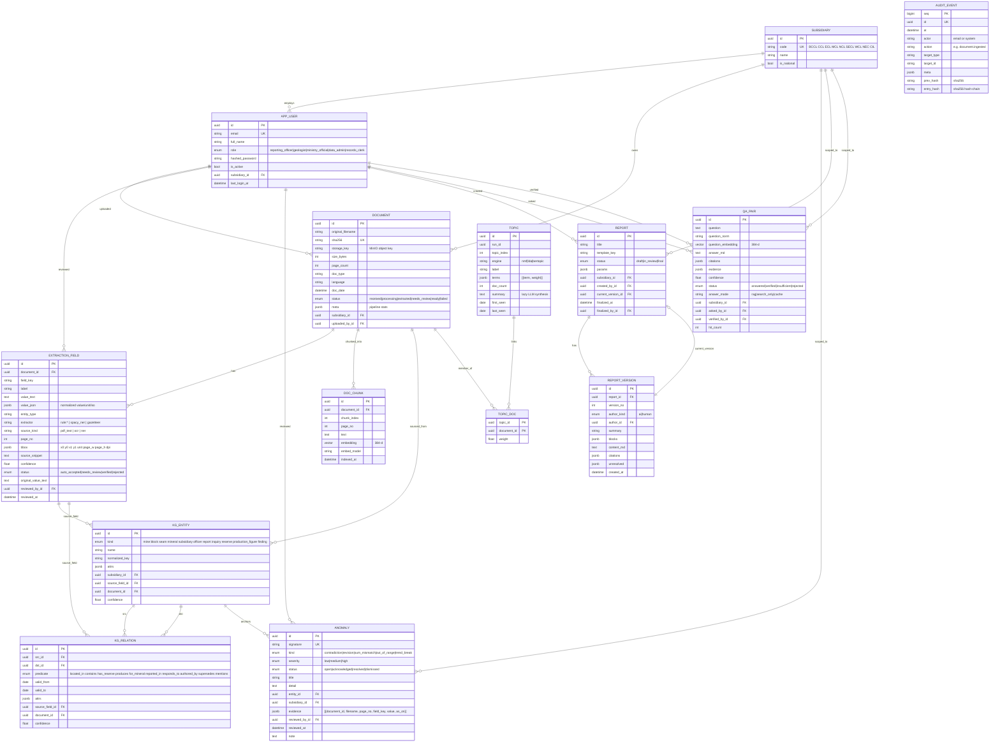

---

## 12. Authentication & Authorization

### Method (implemented — `app/core/security.py`, `app/api/deps.py`)

- **Passwords:** bcrypt (`bcrypt.hashpw` / `checkpw`, input truncated to 72 bytes).
- **Tokens:** HS256 JWT via `python-jose`, signed with `JWT_SECRET`.
  - Access token TTL `JWT_ACCESS_TTL_MIN` (default 30 min), claims `sub`, `email`, `role`,
    `subsidiary_id`, `type=access`.
  - Refresh token TTL `JWT_REFRESH_TTL_DAYS` (default 7 days), claim `sub`, `type=refresh`.
  - `decode_token(expect_type=...)` rejects a token of the wrong type.
- **Transport:** bearer token in the `Authorization` header; the frontend stores it in
  `localStorage` (`coalmind-token` / `coalmind-user`) and drops it on any `401`.
- **No token + `AUTH_REQUIRED=false`** (dev/demo default): the request runs as the seeded
  `admin@coalindia.in` (`data_admin`), audit attributed via `X-Actor-Email` when supplied.
- **`AUTH_REQUIRED=true`:** a missing/invalid token → `401`.

### Authorization

- `require_roles(*roles)` dependency — used by `/admin/*` (`data_admin`, and some also
  `ministry_official`).
- **Per-subsidiary row scoping** — `Principal.scoped` is true for non-global roles
  (`reporting_officer`, `geologist`, `records_clerk`) with a `subsidiary_id`. Scoped
  principals see only rows where `subsidiary_id == their subsidiary OR subsidiary_id IS
  NULL` (national). Enforced in `/ingestion/documents`, `/review/queue`, `/query`,
  `/anomalies`. `data_admin` and `ministry_official` are global.
- Query scope is additionally checked: a scoped principal cannot ask with a
  `subsidiary_id` other than their own (`403`).

### Flow

```mermaid
sequenceDiagram
    autonumber
    actor U as User
    participant FE as Frontend (LoginPage / lib/auth.ts)
    participant API as /auth/login
    participant SEC as core/security
    participant DB as PostgreSQL (app_user)
    participant AUD as audit_event
    participant R as Any protected route
    participant DEP as deps.get_principal

    U->>FE: email + password
    FE->>API: POST /auth/login {email, password}
    API->>DB: SELECT user WHERE email = lower(email)
    API->>SEC: verify_password(password, user.hashed_password)
    alt invalid
        API->>AUD: auth.login_failed
        API-->>FE: 401 invalid email or password
    else valid
        API->>DB: user.last_login_at = now()
        API->>AUD: auth.login
        API->>SEC: create_access_token(claims) + create_refresh_token({sub})
        API-->>FE: {access_token, refresh_token, user}
        FE->>FE: setSession() → localStorage
    end
    U->>FE: navigate / act
    FE->>R: request + Authorization: Bearer <access>
    R->>DEP: get_principal(authorization)
    DEP->>SEC: decode_token(token, expect_type=access)
    DEP->>DB: SELECT user by sub ; check is_active
    DEP-->>R: Principal(email, role, subsidiary_id, scoped, is_authenticated=true)
    R->>R: require_roles(...) and/or row-scope filter
    R-->>FE: authorized response
    Note over FE,API: on 401 for a non-/auth path → clearSession(), fall back to dev session
```

### Demo accounts (seeded by `scripts/seed_db.py`, password = `SEED_USER_PASSWORD`, default `coalmind`)

| Email | Role | Subsidiary |
|---|---|---|
| `admin@coalindia.in` | `data_admin` | CIL (national) |
| `ministry@coal.gov.in` | `ministry_official` | CIL |
| `officer@cmpdi.co.in` | `reporting_officer` | CIL |
| `geologist@ccl.co.in` | `geologist` | CCL (subsidiary-scoped) |
| `clerk@bccl.co.in` | `records_clerk` | BCCL (subsidiary-scoped) |

---

## 13. External Integrations

Every external dependency is optional or self-hostable; none is a hosted SaaS required for
the platform to run.

| Service | Purpose | Data exchanged | Auth | Where used |
|---|---|---|---|---|
| **PostgreSQL 16 + pgvector** | Primary datastore: structured data, KG, audit, 384-d vectors | SQL queries + vector similarity | user/password (`POSTGRES_*` / `DATABASE_URL`) | everywhere via `core/db.py` |
| **MinIO / S3** | Content-addressed document object store | document bytes upload/download, presigned GET URLs | `MINIO_ROOT_USER` / `MINIO_ROOT_PASSWORD` | `services/storage/minio_client.py` |
| **Ollama** | On-prem LLM (default). Local `:11434` or a GPU-hosted instance behind a tunnel | prompt text out, generated text in (`/api/chat`, `/api/generate`, `/api/tags` for health) | none (adds `ngrok-skip-browser-warning` header) | `services/llm/ollama.py` |
| **Tesseract OCR 5.x** | Text + per-word geometry + confidence for scanned pages / images | page raster in, `image_to_data` dict out; `get_languages` probe | local binary | `services/ingestion/page_extract.py` |
| **fastembed model cache** (HuggingFace) | One-time download of `BAAI/bge-small-en-v1.5` ONNX weights | model download on first embed | none | `services/embeddings/fastembed_embedder.py` |
| **spaCy `en_core_web_sm`** | NER for supplemental entity mentions; installed as a wheel dependency | in-process | none | `services/extraction/ner.py` |
| **Anthropic API** *(optional, gated)* | Hosted LLM fallback (`claude-sonnet-5`) | prompt/response | `ANTHROPIC_API_KEY` | `services/llm/anthropic_provider.py` |
| **OpenRouter API** *(optional, gated)* | Hosted LLM fallback (`openai/gpt-4o-mini`) via `httpx` | prompt/response | `OPENROUTER_API_KEY` | `services/llm/openrouter.py` |

```mermaid
flowchart LR
    APP["CoalMind backend"]
    APP -->|SQL + vector| PG[("PostgreSQL 16\n+ pgvector + pg_trgm")]
    APP -->|S3 API| MINIO[("MinIO")]
    APP -->|"/api/chat, /api/generate"| OLLAMA["Ollama LLM"]
    APP -->|image_to_data| TESS["Tesseract OCR"]
    APP -->|first-run download| CACHE["fastembed / spaCy models"]
    APP -. "get_llm() sovereignty gate\nALLOW_THIRD_PARTY_API" .-> ANT["Anthropic API"]
    APP -. gated .-> OR["OpenRouter API"]
```

---

## 14. AI / ML Architecture

CoalMind uses **no trained/fine-tuned models of its own**. Every ML component is either a
pretrained off-the-shelf model (embeddings, NER) or a classical unsupervised method
(TF-IDF + NMF). This section is explicit about what is measured data vs model output vs
fallback.

### 14.1 Components

| Component | Model / method | Type | Runs |
|---|---|---|---|
| Document classification | Weighted keyword scoring (`classifier._RULES`, English + Devanagari + roman-Hindi aliases) | Deterministic rules (no ML) | ingestion pipeline |
| Language detection | Devanagari character ratio | Deterministic | ingestion pipeline |
| OCR | Tesseract 5.x LSTM (`eng`, optional `hin`) | Pretrained, external | pages with no text layer + image uploads |
| Field extraction | Table-driven regex `Spec`s per doc type | Deterministic rules | extraction |
| Supplemental NER | spaCy `en_core_web_sm` + regex gazetteer (seam / borehole / grade / subsidiary / mine) | Pretrained (small) + rules | extraction |
| Confidence scoring | Heuristic: `base_conf` × OCR penalty (informed by Tesseract per-word conf) × context damping, capped 0.97 | Deterministic heuristic | extraction |
| Embeddings | `BAAI/bge-small-en-v1.5` (384-d) via fastembed/ONNX, or Ollama | Pretrained, on-prem | KG indexing, RAG, topics, answer cache |
| Retrieval | KG entity/fact traversal + pgvector cosine passage search | Deterministic + vector similarity | RAG, semantic search |
| Answer composition | LLM (Ollama `mistral` default) constrained to numbered sources; deterministic fallback | Generative (gated) | RAG |
| Topic modelling | scikit-learn TF-IDF → **NMF** (`lda` optional; `bertopic` import-guarded, not installed) | Classical unsupervised | topics rebuild |
| Term normalisation | Variant→canonical map + domain stoplist (`topics/normalize.py`) | Deterministic | topics / word cloud |
| Topic synthesis | LLM one-paragraph "what's driving this" | Generative (gated), lazy | topic drill-down |
| Anomaly detection | Statistical comparison of KG fact nodes (relative 2% / abs 0.01 tolerance; trend break > 2.5σ) | Deterministic statistics | anomaly scan |

### 14.2 Data provenance — what is what

| Category | In CoalMind | Notes |
|---|---|---|
| **Real-world measured data** | *None shipped.* `ml/sample_corpus/` is **synthetic** — realistic in structure, invented figures (`scripts/gen_sample_corpus.py`) | Replace with a real pilot corpus before any deployment |
| **Ground-truth targets** | `ml/sample_corpus/ground_truth/*.json` — the value an ideal reader would record per field | Used only by `scripts/eval_extraction.py` to score extraction; not used at runtime |
| **Model-generated data** | KG entities/relations, embeddings, topic clusters, LLM narrative in reports/answers/topic summaries | LLM prose is constrained to cited source spans; markers preserved |
| **Predictions / scores** | Per-field `confidence`, retrieval `score`, answer `confidence`, anomaly `severity` | Heuristic, not calibrated probabilities |
| **Fallback data** | Deterministic report narrative (`COALMIND_NARRATIVE_LLM=0`), search-only answers when the LLM is down, OCR-language downgrade to `eng` | Chosen so a demo never hard-fails on a missing dependency |

### 14.3 "Training" pipeline (there is none — this is the offline evaluation loop)

```mermaid
flowchart LR
    GEN["scripts/gen_sample_corpus.py\n(reportlab)"] --> PDFS["ml/sample_corpus/*.pdf + .txt"]
    GEN --> GT["ml/sample_corpus/ground_truth/*.json"]
    PDFS --> RUN["scripts/eval_extraction.py\nextract_pages → classify → extract_fields  (NO DB)"]
    GT --> SCORE["score: classification, field P/R/F1\n(digital vs degraded-scan), coverage,\neffective accuracy after review"]
    RUN --> SCORE
    SCORE --> GATE["pytest gate tests/test_extraction_eval.py\n(class ≥85%, digital F1 ≥0.90, 0 silent errors/misses)"]
```

### 14.4 Inference pipeline (RAG)

```mermaid
flowchart LR
    Q["question"] --> N["normalize_question + embed (bge-small)"]
    N --> C{"verified cache\ncosine ≥ 0.90"}
    C -->|hit| OUT1["cached answer + citations"]
    C -->|miss| R1["KG: match_entities on distinctive tokens\n→ neighbor fact nodes → Evidence(kind=fact)"]
    N --> R2["pgvector: cosine over doc_chunk\n→ Evidence(kind=passage)"]
    R1 --> RANK["rank by score"]
    R2 --> RANK
    RANK --> FLOOR{"top < 0.50 OR (no fact AND best passage < 0.58)"}
    FLOOR -->|yes| DECL["INSUFFICIENT + closest sources"]
    FLOOR -->|no| GEN["LLM.chat(system + [1..n] sources)\ntemp 0.1, max 350 tok"]
    GEN -->|unavailable| SO["search-only ranked sources"]
    GEN -->|'INSUFFICIENT'| DECL
    GEN --> POST["[n]→[[c:n]]; add markers if missing (×0.85 conf)"]
    POST --> OUT2["QAPair(answer_md, citations, evidence, confidence, mode)"]
```

### 14.5 Evaluation metrics (from `scripts/eval_extraction.py`, surfaced at `/validation/summary`)

- **Classification accuracy** — predicted `doc_type` vs ground truth, split digital vs
  degraded-scan.
- **Field precision / recall / F1** — over fields the rules engine targets (`GT_ALIASES`
  maps ground-truth keys to extractor keys; unmapped keys count as *coverage gaps*, not
  misses). Number match within 0.5%, exact date match, abbreviation-aware text match.
- **Coverage** — share of ground-truth fields the engine even attempts.
- **Effective accuracy after review** — `1 − (silent_error + silent_miss) / N`, where a
  silent error is a wrong value auto-accepted above threshold and a silent miss is a
  ground-truth field never extracted (both escape the review queue).
- Last recorded result (README history / `/validation`): 8/8 classification, F1 = 1.00,
  100% field coverage on the sample corpus.

---

## 15. Background Processing & Jobs

### What exists

| Mechanism | Trigger | Work | Status |
|---|---|---|---|
| **FastAPI `BackgroundTasks`** | `POST /ingestion/documents`, `POST /ingestion/documents/{id}/reprocess` | `run_pipeline(document_id)` — parse → classify → extract → persist fields → build KG + embed | **Implemented.** Runs in the server process on a worker thread; `run_pipeline` opens its own DB session so it is transport-agnostic |
| **CLI batch runner** | `python -m app.workers.ingest_cli [paths… | --samples | --reprocess | --build-kg]` (and `scripts/dev.py ingest-samples` / `build-kg`) | Same pipeline / KG rebuild over local files or every document | **Implemented** |
| **`scripts/dev.py` tasks** | Operator, on demand | `topics` (NMF rebuild), `anomalies` (KG scan), `eval`, `perf`, `audit-rehash`, `reset-demo` | **Implemented** (manual, not scheduled) |
| **`arq` + Redis queue** | — | Off-process durable job queue | **Declared as a dependency, NOT wired.** The swap-in point is `background.add_task(run_pipeline, …)`; documented as the scale path |
| **Cron / scheduler** | — | Periodic re-scan / re-topic | **Not implemented** |

```mermaid
flowchart TD
    UP["POST /ingestion/documents"] --> ADD["background.add_task(run_pipeline, doc_id)"]
    ADD --> RESP["201 returned immediately\n(queued_for_processing = n)"]
    ADD --> RUN["run_pipeline(doc_id) — own SessionLocal"]
    RUN --> P1["status = processing + audit"]
    P1 --> P2["extract_pages → classify → extract_fields"]
    P2 --> P3["replace ExtractionField rows\nstatus = ready | needs_review | extracted"]
    P3 --> P4["audit document.extracted"]
    P4 --> P5["build_knowledge: resolve KG + embed chunks"]
    P5 -->|exception| FAIL["rollback → status = failed\ndoc.error set + audit document.failed"]
    P5 --> DONE["audit knowledge.built"]

    CLI["ingest_cli --reprocess / --build-kg"] --> RUN
    OPS["dev.py topics | anomalies"] --> TREBUILD["rebuild_topics() / scan_anomalies()\nidempotent, own session, audited"]
```

**Idempotency / safety:** `run_pipeline` deletes and re-creates a document's extraction
fields; `resolve_document` wipes and rebuilds that document's relations + fact nodes;
`scan_anomalies` upserts by `signature` and auto-resolves anomalies that no longer
reproduce; topic rebuild keeps only the latest `run_id`; the audit chain append is
serialised by a Postgres advisory lock.

---

## 16. Error Handling Flow

### Principles observed in the code

- **API validation** — Pydantic schemas + explicit `HTTPException` with conventional codes
  (`400` empty file, `413` too large, `404` missing, `409` illegal state transition,
  `422` bad value / unknown template, `403` out-of-scope, `401` bad/absent token).
- **Pipeline failures are captured, not fatal** — `run_pipeline` wraps `_process` in
  `try/except`, rolls back, sets `document.status = failed`, stores `document.error`, and
  writes `document.failed` to the audit trail. The worker never crashes.
- **Best-effort sub-steps** — KG build and vector indexing failures are logged and swallowed
  (`stats["index_error"]`) so a successful extraction is still persisted; a post-review KG
  rebuild that fails rolls back without failing the review.
- **Graceful LLM degradation** — `get_llm()` raises `LLMUnavailable` when the provider is
  unreachable or disallowed; RAG returns a **search-only** answer, reports fall back to
  **deterministic** narrative, and `/health` reports `llm: down` / `blocked` while staying
  `200`.
- **OCR language fallback** — an unavailable `hin` pack downgrades to `eng` per-call.
- **Auth** — a `401` on any non-`/auth` path makes the frontend drop the token and continue
  as the dev session.
- **Audit chain** — `verify_chain` returns `{ok:false, first_broken_seq}` on tamper/fork
  rather than raising; `rehash_chain` (`dev.py audit-rehash`) repairs it.

```mermaid
flowchart TD
    REQ["Incoming request"] --> VAL{"Pydantic + guard checks"}
    VAL -->|invalid| E4XX["HTTPException 400/401/403/404/409/413/422\n→ {detail}"]
    VAL -->|ok| SVC["Service call"]
    SVC --> DEP{"External dependency?"}
    DEP -->|LLM unreachable/disallowed| LLMU["LLMUnavailable\n→ search-only / deterministic / health: blocked|down"]
    DEP -->|embeddings down| EMBU["EmbeddingUnavailable\n→ index step skipped, logged"]
    DEP -->|DB error| DBE["500 (unhandled) — surfaced by FastAPI; request txn rolled back"]
    DEP -->|ok| WORK["Business logic"]
    WORK -->|pipeline exception| PIPE["rollback → document.status=failed\n+ audit document.failed (worker survives)"]
    WORK -->|state conflict| E409["409 (e.g. finalize with unresolved fields, review already-decided field)"]
    WORK -->|success| OK["2xx + response_model\n+ audit event in same transaction"]
```

---

## 17. Security Architecture

Only mechanisms verified in code are claimed.

| Area | Implementation | Location |
|---|---|---|
| **Password storage** | bcrypt with per-hash salt; 72-byte truncation | `core/security.py` |
| **Session tokens** | HS256 JWT, typed access/refresh, TTL-bound, signature-verified | `core/security.py` |
| **Auth enforcement** | `AUTH_REQUIRED` flag; `get_principal` rejects invalid/expired/inactive; dev fallback is explicit | `api/deps.py` |
| **RBAC** | `require_roles()` on `/admin/*`; global vs scoped roles | `api/deps.py`, `routes/admin.py` |
| **Row-level scoping** | subsidiary-scoped principals see `subsidiary_id == mine OR NULL` on documents / review / query / anomalies; query-scope override rejected with `403` | `routes/ingestion.py`, `review.py`, `query.py`, `anomalies.py` |
| **Data-sovereignty gate** | `get_llm()` refuses `anthropic` / `openrouter` unless `ALLOW_THIRD_PARTY_API=true` — raises `LLMUnavailable`, platform degrades to on-prem/search-only | `services/llm/factory.py` |
| **On-prem embeddings** | fastembed (ONNX, local) is the default; no embedding data leaves the host | `services/embeddings/` |
| **Audit trail** | append-only `audit_event`; every mutation writes `record_event` in the same transaction; SHA-256 hash chain (`prev_hash`/`entry_hash` over canonical JSON); `pg_advisory_xact_lock` serialises appends so concurrent writers can't fork the chain; `verify_chain` detects tamper/fork, `rehash_chain` repairs | `audit/writer.py`, `audit/verify.py` |
| **Input size limits** | 40 MB per uploaded file | `routes/ingestion.py` |
| **CORS** | explicit allow-list from `CORS_ORIGINS` | `main.py` |
| **Secrets** | environment-only via `Settings`; `.env` is git-ignored (`.env.example` tracked) | `core/config.py`, `.gitignore` |
| **Content-addressed storage** | object keys derived from SHA-256; identical bytes stored once | `services/storage/minio_client.py` |
| **Presigned URLs** | document downloads via short-lived (15 min) presigned GET, not public buckets (`mc anonymous set none`) | `routes/ingestion.py`, `docker-compose.yml` |

**Not implemented / deployment-time:** rate limiting, TLS termination, encryption at rest,
secret-manager integration, refresh-token rotation/revocation lists, CSRF (N/A for bearer
tokens), audit-log external anchoring. `JWT_SECRET` defaults to `dev-only-change-me` and
**must** be overridden.

```mermaid
flowchart TD
    REQ["Request"] --> TLS["(deployment) TLS termination — not in app"]
    TLS --> CORS["CORS allow-list"]
    CORS --> TOK{"Bearer token?"}
    TOK -->|yes| DEC["decode_token → user lookup → is_active"]
    TOK -->|no| FLAG{"AUTH_REQUIRED?"}
    FLAG -->|true| D401["401"]
    FLAG -->|false| DEV["dev principal = data_admin"]
    DEC --> PR["Principal(role, subsidiary_id, scoped)"]
    DEV --> PR
    PR --> ROLE{"require_roles?"}
    ROLE -->|fail| D403["403"]
    ROLE -->|pass| SCOPE["row-scope filter (subsidiary + national)"]
    SCOPE --> HANDLER["handler + service"]
    HANDLER --> LLMGATE{"hosted LLM & !ALLOW_THIRD_PARTY_API"}
    LLMGATE -->|blocked| DEGRADE["LLMUnavailable → degrade"]
    HANDLER --> AUD["record_event (hash-chained, same txn)"]
```

---

## 18. Deployment Architecture

### Current state (implemented)

- **Local development only.** `docker-compose.yml` runs the two stateful services;
  application processes (FastAPI, Vite) run on the host for fast reload; Ollama runs on the
  host or a remote GPU box.
- No Dockerfile for the app, no Kubernetes/Helm manifests, no CI/CD pipeline yet (all noted
  as "Next" in project docs and [§27](#27-roadmap)).

```mermaid
flowchart TB
    subgraph Host["Developer host"]
        API["uvicorn app.main:app --reload\n:8000"]
        WEB["vite dev server\n:5173 (proxies /api → :8000)"]
        OLLAMA["ollama serve :11434\n(or remote GPU via OLLAMA_BASE_URL tunnel)"]
        TESS["Tesseract binary"]
    end
    subgraph Compose["docker compose (name: coalmind)"]
        PG[("postgres:16 + pgvector\n:5432→ POSTGRES_PORT (5433 to dodge local PG)\nvolume pgdata")]
        MINIO[("minio\n:9000 API / :9001 console\nvolume miniodata")]
        SETUP["minio-setup (one-shot)\ncreates docs bucket, anonymous=none"]
    end
    WEB --> API
    API --> PG
    API --> MINIO
    API --> OLLAMA
    API --> TESS
    SETUP --> MINIO
```

### Target architecture (from `docs/architecture.md` §6 — planned, not built)

Container images for backend + frontend + worker; managed Postgres, MinIO/S3, Redis, and an
on-prem open-weight LLM server; k8s/Helm manifests for on-prem or **MeghRaj (GI Cloud)**;
no component depends on a hosted API when `ALLOW_THIRD_PARTY_API=false`.

```mermaid
flowchart LR
    DEV["Developer"] --> GIT["Git repository"]
    GIT -.->|planned| CI["CI: pytest + ruff + tsc + vite build"]
    CI -.->|planned| IMG["Container images:\nbackend · frontend · worker"]
    IMG -.->|planned| K8S["k8s / Helm (on-prem / MeghRaj)"]
    K8S -.-> SVCS["Managed: PostgreSQL+pgvector · MinIO/S3 · Redis · on-prem LLM server"]
```

### Build & run process (today)

| Step | Command |
|---|---|
| Infra up | `python scripts/dev.py up` (docker compose up -d) |
| Migrate | `python scripts/dev.py migrate` (`alembic upgrade head`) |
| Seed | `python scripts/dev.py seed` |
| Sample corpus | `python scripts/dev.py corpus` then `ingest-samples`, `build-kg` |
| Backend | `python scripts/dev.py api` → `:8000` |
| Frontend (dev) | `python scripts/dev.py web` → `:5173` |
| Frontend (build) | `cd frontend && npm run build` → static `dist/` (serve behind any static host; set `VITE_API_BASE_URL`) |

---

## 19. Installation Guide

### 19.1 Prerequisites

| Requirement | Version | Notes |
|---|---|---|
| Docker + Docker Compose | current | Postgres + MinIO containers |
| Python | 3.12+ | backend venv is pinned to 3.12 |
| [`uv`](https://docs.astral.sh/uv/) | latest | Python dependency + venv manager |
| Node.js | 20+ | frontend (Vite 6) |
| Tesseract OCR | 5.x | needed for M1+ (scanned pages / images). `eng` is enough; `hin` optional |
| Ollama | latest | `ollama pull mistral` so the LLM health check goes green (optional — platform degrades without it) |

### 19.2 Clone

```bash
git clone <this-repo-url> SIH26023
cd SIH26023
```

### 19.3 Environment configuration

```bash
cp .env.example .env
```

Then edit `.env` (see [§20](#20-environment-variables)). Common local change: if the host
already runs Postgres on 5432, set `POSTGRES_PORT=5433` (the compose file maps
container 5432 → host `POSTGRES_PORT`, and the backend reads the same value).

### 19.4 Backend dependencies

```bash
cd backend
uv sync --extra dev      # installs runtime + dev deps + spaCy en_core_web_sm + reportlab
cd ..
```

### 19.5 Infra + database

```bash
python scripts/dev.py bootstrap
# = docker compose up -d  →  alembic upgrade head  →  seed_db.py  →  gen_sample_corpus.py
```

This starts Postgres (with `vector` + `pg_trgm` created on first boot) and MinIO (with the
`coalmind-documents` bucket created), runs all 8 migrations, seeds 9 subsidiaries + 5 demo
users, and generates the synthetic sample corpus.

### 19.6 Load the sample corpus (optional but recommended)

```bash
python scripts/dev.py ingest-samples   # runs every ml/sample_corpus/ file through the M1 pipeline
python scripts/dev.py build-kg         # (re)build the knowledge graph + vector index
python scripts/dev.py anomalies        # scan the graph for historical-vs-new inconsistencies
# optional: python scripts/dev.py topics   # build the topic set / word cloud
```

### 19.7 Frontend dependencies

```bash
cd frontend
npm install                 # under OneDrive/Windows, if lifecycle scripts choke: npm install --ignore-scripts
cd ..
```

### 19.8 Run

```bash
python scripts/dev.py api   # FastAPI on http://localhost:8000  (/docs, /health)
python scripts/dev.py web   # Vite on   http://localhost:5173   (separate shell)
```

### 19.9 API keys

None required for the default (on-prem) configuration. Only needed if you switch
`LLM_PROVIDER`:

- **Anthropic:** create a key at the Anthropic console → `ANTHROPIC_API_KEY`, set
  `LLM_PROVIDER=anthropic` and `ALLOW_THIRD_PARTY_API=true`.
- **OpenRouter:** create a key at openrouter.ai → `OPENROUTER_API_KEY`, set
  `LLM_PROVIDER=openrouter` and `ALLOW_THIRD_PARTY_API=true`.

### 19.10 Verify

```bash
curl http://localhost:8000/health      # expect status ok, db ok (llm may be "down" without Ollama)
cd backend && uv run pytest -q          # ~80 tests (DB-backed ones auto-skip if Postgres is down)
```

Open <http://localhost:5173> — the header **health badge** should read *backend ok* with
`db` / `storage` green (and `llm` / `embeddings` green once Ollama + the embedding model are
ready). Sign in top-right with a demo account (password `coalmind`), or stay signed out in
dev.

### 19.11 Individual tasks

```bash
python scripts/dev.py up | down | migrate | seed | corpus | api | web | test | lint | bootstrap
python scripts/dev.py ingest-samples | build-kg | topics | anomalies | eval | perf | audit-rehash | reset-demo
```

`make <task>` equivalents exist for Linux/macOS/WSL (`Makefile`).

---

## 20. Environment Variables

All backend runtime config is read **only** through `backend/app/core/config.py` (typed
`Settings`, loaded from `.env.example` then `.env` — later file wins). Compose-only and
process-only variables are listed separately.

### Backend `Settings` (`.env`)

| Variable | Required | Default | Description |
|---|---|---|---|
| `POSTGRES_USER` | no | `coalmind` | DB user |
| `POSTGRES_PASSWORD` | no | `coalmind` | DB password |
| `POSTGRES_DB` | no | `coalmind` | DB name |
| `POSTGRES_HOST` | no | `localhost` | DB host |
| `POSTGRES_PORT` | no | `5432` | DB port (set `5433` locally to avoid a host Postgres; compose maps container→this) |
| `DATABASE_URL` | no | *(unset)* | Full SQLAlchemy URL; overrides the `POSTGRES_*` parts if set |
| `MINIO_ENDPOINT` | no | `localhost:9000` | MinIO S3 endpoint (`host:port`) |
| `MINIO_ROOT_USER` | no | `coalmind` | MinIO access key |
| `MINIO_ROOT_PASSWORD` | no | `coalmind-secret` | MinIO secret key |
| `MINIO_BUCKET` | no | `coalmind-documents` | Document bucket |
| `MINIO_SECURE` | no | `false` | Use HTTPS to MinIO |
| `LLM_PROVIDER` | no | `ollama` | `ollama` \| `anthropic` \| `openrouter` |
| `LLM_MODEL` | no | `mistral` | Model name for Ollama (and default chat model) |
| `OLLAMA_BASE_URL` | no | `http://localhost:11434` | Local or GPU-tunnelled Ollama |
| `OLLAMA_KEEP_ALIVE` | no | `30m` | Keep the model resident between generations |
| `ANTHROPIC_API_KEY` | if `anthropic` | `""` | Anthropic key |
| `ANTHROPIC_MODEL` | no | `claude-sonnet-5` | Anthropic model |
| `OPENROUTER_API_KEY` | if `openrouter` | `""` | OpenRouter key |
| `OPENROUTER_MODEL` | no | `openai/gpt-4o-mini` | OpenRouter model |
| `OPENROUTER_BASE_URL` | no | `https://openrouter.ai/api/v1` | OpenRouter base URL |
| `EMBED_PROVIDER` | no | `fastembed` | `fastembed` (on-prem) \| `ollama` |
| `EMBED_MODEL` | no | `BAAI/bge-small-en-v1.5` | Embedding model |
| `EMBED_DIM` | no | `384` | Vector dimension (must match the model + DB columns) |
| `ALLOW_THIRD_PARTY_API` | no | `true` *(code default)* | **Set `false` for sovereign deployments** — refuses any hosted-API LLM call. `.env.example` / production should pin this |
| `CONFIDENCE_THRESHOLD` | no | `0.75` | Fields below this go to the human review queue (0.0–1.0) |
| `OCR_LANGUAGES` | no | `eng+hin` | Tesseract languages; auto-degrades to the installed subset |
| `JWT_SECRET` | **yes (prod)** | `dev-only-change-me` | HS256 signing secret — **must** be changed |
| `JWT_ACCESS_TTL_MIN` | no | `30` | Access-token lifetime (minutes) |
| `JWT_REFRESH_TTL_DAYS` | no | `7` | Refresh-token lifetime (days) |
| `AUTH_REQUIRED` | no | `false` | `true` locks the API down; `false` = unauthenticated requests act as seeded `data_admin` |
| `SEED_USER_PASSWORD` | no | `coalmind` | Password set for seeded demo users |
| `API_HOST` | no | `0.0.0.0` | Uvicorn bind host |
| `API_PORT` | no | `8000` | Uvicorn bind port |
| `CORS_ORIGINS` | no | `http://localhost:5173` | Comma-separated allowed origins |

### Docker Compose only (`docker-compose.yml`)

`POSTGRES_USER`, `POSTGRES_PASSWORD`, `POSTGRES_DB`, `POSTGRES_PORT`, `MINIO_ROOT_USER`,
`MINIO_ROOT_PASSWORD`, `MINIO_BUCKET` — same names, consumed by the container definitions.

### Process / build-time (not in `Settings`)

| Variable | Consumed by | Purpose |
|---|---|---|
| `COALMIND_NARRATIVE_LLM` | `rag/answer.py`, report narrative, `tests/conftest.py` | `0` forces deterministic composition (no live LLM call) |
| `FASTEMBED_THREADS` | `embeddings/fastembed_embedder.py` | Cap ONNX intra-op threads (default `cpu//2`) |
| `VITE_API_BASE_URL` | `frontend/vite.config.ts`, `frontend/src/lib/api.ts` | Dev proxy target / built-app backend origin (default `/api` → `http://127.0.0.1:8000`) |

> **Never commit real secrets.** `.env` and `.env.*` are git-ignored; `.env.example` is the
> tracked template with placeholder values.

---

## 21. Configuration Flow

```mermaid
flowchart TD
    ENVEX[".env.example (tracked template)"] --> LOADER["pydantic-settings\nSettingsConfigDict(env_file=(.env.example, .env))"]
    ENV[".env (git-ignored, wins)"] --> LOADER
    OSENV["OS environment (highest precedence)"] --> LOADER
    LOADER --> SETTINGS["Settings object\n(+ computed: sqlalchemy_url, cors_origin_list)"]
    SETTINGS --> CACHE["@lru_cache get_settings()"]
    CACHE --> DB["core/db.py — engine(sqlalchemy_url)"]
    CACHE --> LLMF["services/llm/factory — provider + sovereignty gate"]
    CACHE --> EMBF["services/embeddings/factory — provider + dim"]
    CACHE --> STOR["services/storage — MinIO client"]
    CACHE --> SEC["core/security — JWT TTLs + secret"]
    CACHE --> DEPS["api/deps — AUTH_REQUIRED"]
    CACHE --> PIPE["ingestion/pipeline — CONFIDENCE_THRESHOLD"]
    CACHE --> OCR["ingestion/page_extract — OCR_LANGUAGES"]
    CACHE --> MAIN["main.py — CORS_ORIGINS, lifespan log"]

    COMPOSE["docker-compose.yml env"] --> PGC["postgres container"]
    COMPOSE --> MINC["minio + minio-setup containers"]

    VITEENV["VITE_API_BASE_URL"] --> VITE["vite.config.ts proxy / lib/api.ts BASE"]
```

Nothing else in the codebase reads `os.environ` for configuration (only the three
process-level toggles in [§20](#20-environment-variables) do, by design).

---

## 22. Feature Documentation

### 22.1 Document ingestion & extraction (FR-1, FR-2, FR-3, FR-15)

- **Purpose:** get heterogeneous documents into the platform as classified, geometry-aware,
  confidence-scored structured fields.
- **How it works:** upload (single/bulk, ≤40 MB) → SHA-256 dedupe → content-addressed MinIO
  store → `Document(status=received)` + audit → `BackgroundTask` `run_pipeline`:
  `extract_pages` (pdfplumber text layer with word bboxes; Tesseract OCR fallback for pages
  with < 20 chars of text and for image uploads; plain-text passthrough) → `classify`
  (weighted keywords → one of `geological_reserve_status`, `monthly_production_mis`,
  `parliamentary_qa_response`, `inspection_report`, `borehole_log_summary`,
  `correspondence`, or `unknown`; language via Devanagari ratio; as-on date) →
  `extract_fields` (per-doc-type regex `Spec`s + spaCy NER + gazetteer) → `confidence.score`
  (OCR penalty, context damping, ≤0.97) → routing: `≥ CONFIDENCE_THRESHOLD` →
  `auto_accepted`, else `needs_review`.
- **Modules:** `services/ingestion/*`, `services/extraction/*`.
- **APIs:** `POST/GET /ingestion/documents`, `/documents/{id}`, `/documents/{id}/file`,
  `/documents/{id}/reprocess`.
- **UI:** *Upload & Review* — drag-drop, live documents table, per-document drawer.

### 22.2 Human review queue (FR-3, FR-5, FR-10)

- **Purpose:** no low-confidence value silently enters a report or answer.
- **How it works:** fields with `status = needs_review` are listed lowest-confidence-first
  with their source snippet, page link and confidence bar. An officer confirms, corrects
  (new `value_text`, original preserved), or rejects each. Each decision writes
  `field.<action>` to the audit trail with before/after + actor, recomputes the parent
  document's status, and rebuilds that document's slice of the knowledge graph.
- **Modules:** `routes/review.py`, `services/knowledge`.
- **APIs:** `GET /review/queue`, `POST /review/fields/{id}`.
- **UI:** *Upload & Review* → review queue with inline confirm/correct/reject.

### 22.3 Domain knowledge graph + vector index (FR-7 foundation)

- **Purpose:** a relational, temporal representation the report/RAG/anomaly engines reason
  over — not flat chunks.
- **How it works:** `resolve_document` turns a document's **accepted** (`auto_accepted` +
  `verified`) fields into typed entities (mine / block / seam / mineral / subsidiary /
  officer / report / inquiry) and document-specific fact nodes (reserve / production_figure
  / finding), linked by predicates (`located_in`, `contains`, `has_reserve`, `produces`,
  `for_mineral`, `reported_in` — *the* traceability edge, `responds_to`, `supersedes`,
  `mentions`) with `valid_from` stamped from the as-on date. Named entities are merged
  across documents by `(kind, normalized_key, subsidiary_id)`; fact nodes + relations are
  rebuilt per document. Separately, `index_document` chunks the text (sentence-aware,
  overlapping) and embeds each chunk into `doc_chunk.embedding` (pgvector, 384-d).
- **Modules:** `services/knowledge/*`.
- **APIs:** `/knowledge/stats`, `/entities`, `/entities/{id}?as_of=`, `/graph`,
  `/documents/{id}/subgraph`, `/search`.
- **UI:** *Facts & Entities* — entity browser, relation navigation, document graph,
  semantic search.

### 22.4 Report generation (FR-4, FR-5, FR-13)

- **Purpose:** produce cited, confidence-gated, version-controlled report drafts.
- **Templates (4):** `geological_reserve_status` (Geological Reserve Status Report),
  `parliamentary_qa` (Parliamentary Q&A Response), `monthly_production_mis` (Monthly
  Production / MIS Report), `adhoc_inquiry` (Ad-hoc Administrative Inquiry Response). Each
  exposes a `param_schema` the frontend renders as a form.
- **How it works:** `Template.build` fills slots from KG queries + live `ExtractionField`
  values, attaching a citation `{document_id, page_no, field_key, extraction_field_id,
  snippet, confidence}` to every figure via a `CitationCollector`. Bound fields still in
  `needs_review` become `unresolved` and put the report `in_review`, which **blocks
  finalisation**. Narrative prose is extractive-first LLM (deterministic fallback) with
  citation markers preserved. Every render/edit appends a `ReportVersion` tagged `ai` or
  `human`; `GET /reports/{id}/diff` shows a unified diff. Export renders `blocks` to PDF
  (xhtml2pdf), DOCX (python-docx) or HTML.
- **APIs:** `/reports/templates`, `POST/GET /reports`, `/reports/{id}`,
  `/reports/{id}/{rerender,edit,finalize,diff,export}`, `/reports/{id}/versions/{n}`.
- **UI:** *Report Builder*.

### 22.5 AI query & response (FR-7, FR-8, FR-9)

- **Purpose:** natural-language questions with cited, source-linked answers that decline
  rather than fabricate.
- **How it works:** see [§14.4](#144-inference-pipeline-rag). Verified-answer cache (cosine
  ≥ 0.90) → graph-fact + vector-passage retrieval, role-scoped → evidence-floor check
  (decline below 0.50, or below 0.58 with no graph fact) → LLM composition constrained to
  numbered sources (system prompt forbids new facts, mandates `[n]`, answers in the
  question's language, returns `INSUFFICIENT` when sources don't answer) → search-only if
  the LLM is unavailable. Officers `verify` (→ cache) or `reject` answers.
- **APIs:** `POST /query`, `/query/history`, `/query/cache`, `/query/{id}`,
  `/query/{id}/{verify,reject}`.
- **UI:** *Ask CoalMind* — chat with `AnswerCard` (prose + `[n]` citations + confidence +
  evidence trace).

### 22.6 Topics, word cloud & trends (FR-6, FR-11)

- **Purpose:** surface emerging themes proactively.
- **How it works:** `rebuild_topics` assembles one text blob per document from its chunks,
  runs TF-IDF → NMF (`n_topics` 2–20; `lda` alternative; `bertopic` import-guarded), stores
  `Topic` + `TopicDoc` for the latest `run_id`. Term normalisation merges Hindi/English/
  transliterated variants (khadan/colliery → mine, etc.) and applies a domain stoplist.
  `word_frequencies` powers the filterable word cloud (subsidiary / doc_type / since);
  `trends` buckets by `document.doc_date`. Topic drill-down lazily generates a one-paragraph
  LLM synthesis.
- **APIs:** `/topics`, `/topics/wordcloud`, `/topics/trends`, `/topics/rebuild`,
  `/topics/{id}`.
- **UI:** *Topics & Trends* — word cloud, trend chart, topic drawer.

### 22.7 Anomaly detection (FR-14)

- **Purpose:** flag inconsistencies between historical and new data for the same entity.
- **Kinds:** `revision` (value changed across dates), `contradiction` (different values for
  the same as-on date), `sum_mismatch` (proved+indicated+inferred ≠ stated total),
  `out_of_range` (negative / implausible / % outside 0–110), `trend_break` (> 2.5σ from the
  metric's mean, ≥ 4 points). Tolerance: relative 2% or absolute 0.01.
- **How it works:** `scan_anomalies` groups KG fact nodes by `(anchor entity, category)`,
  runs the detectors, upserts `Anomaly` rows by stable `signature`, auto-resolves rows that
  no longer reproduce, and audits `anomaly.scan`. Each row carries `evidence[]` with
  `{document, page, field, value, as_on}`. Officers move rows `open → acknowledged /
  resolved / dismissed`.
- **APIs:** `GET /anomalies`, `POST /anomalies/scan`, `/anomalies/{id}`,
  `/anomalies/{id}/review`.
- **UI:** *Anomalies* review screen + Dashboard summary.

### 22.8 Security, RBAC & admin (FR-9, FR-10, FR-12)

- **Purpose:** access control, auditability, and operational visibility.
- **How it works:** JWT auth + per-subsidiary row scoping ([§12](#12-authentication--authorization)),
  hash-chained audit trail with `verify_chain` ([§17](#17-security-architecture)), and an
  admin console: platform counts, `SecurityPosture` (auth flag, LLM effective mode,
  embeddings on-prem, `audit_chain_ok`), filtered audit log, chain verification, user CRUD
  + password set, extraction-quality metrics, ingestion monitoring.
- **APIs:** `/admin/*`.
- **UI:** *Admin* + *Validation* screens.

### 22.9 Validation & benchmarking

- **Purpose:** make accuracy and performance claims checkable.
- **How it works:** `/validation/summary` runs `scripts/eval_extraction.py` live against the
  sample corpus + ground truth (no DB, memoised 5 min) for classification / field P·R·F1 /
  coverage / effective-accuracy-after-review, and returns the last measured `dev.py perf`
  latency + concurrency figures plus test counts and methodology notes.
- **UI:** *Validation* screen.

### 22.10 Bilingual (Hindi/English) support (FR-11)

- OCR defaults to `eng+hin` and probes Tesseract, degrading to the installed subset (and to
  `eng` per-call on a load error).
- The classifier's keyword table carries Devanagari and roman-Hindi aliases for every doc
  type.
- The RAG system prompt instructs the model to answer in the question's language.
- The bundled Hindi sample MIS is UTF-8 text (needs no Devanagari font or `hin` pack to
  demo).

---

## 23. Testing Architecture

### What exists

- **Backend:** `pytest` (`pytest-asyncio`, `asyncio_mode=auto`), 16 test modules,
  ~80 tests (`/validation/summary` reports `backend: 80`).
  - `tests/conftest.py` provides a session-scoped `TestClient` and a `db_or_skip` fixture
    that **skips** DB-backed tests when Postgres is unreachable (offline CI). It also sets
    `ALLOW_THIRD_PARTY_API=true` and `COALMIND_NARRATIVE_LLM=0` for determinism.
  - Modules: `test_health`, `test_config`, `test_providers`, `test_embeddings`,
    `test_classifier`, `test_extraction`, `test_extraction_eval` (benchmark gate),
    `test_review_flow`, `test_knowledge`, `test_reports`, `test_query`, `test_topics`,
    `test_anomaly`, `test_auth`, `test_admin`, `test_perf` (performance gate).
- **Regression gates:**
  - `tests/test_extraction_eval.py` — wraps `scripts/eval_extraction.py`; fails if
    classification < 85%, digital-doc F1 < 0.90, or any silent error/miss.
  - `tests/test_perf.py` — wraps `scripts/perf_bench.py`; fails if a PRD latency NFR is
    missed (cached answer < 5 s, fresh RAG < 20 s).
- **Frontend:** no unit/e2e test runner. Quality gates are `tsc -b` (typecheck),
  `eslint . --max-warnings 0`, and `vite build`.
- **No** integration/e2e suite (Playwright/Cypress), no coverage reporting, no CI
  automation.

```mermaid
flowchart TD
    subgraph Backend
        UNIT["unit: classifier, extraction, confidence,\nconfig, providers, embeddings"]
        DBT["DB-backed: review flow, knowledge, reports,\nquery, topics, anomaly, auth, admin\n(auto-skip if no Postgres)"]
        EVALG["gate: test_extraction_eval → eval_extraction.py vs ground truth"]
        PERFG["gate: test_perf → perf_bench.py vs PRD NFRs"]
    end
    subgraph Frontend
        TSC["tsc -b (typecheck)"]
        ESL["eslint --max-warnings 0"]
        BUILD["vite build"]
    end
    CMD["python scripts/dev.py test"] --> UNIT & DBT & EVALG & PERFG
    CMD2["python scripts/dev.py lint"] --> ESL
    CMD2 --> RUFF["ruff check . (backend)"]
```

### Commands

```bash
cd backend && uv run pytest -q          # all backend tests
cd backend && uv run ruff check .       # backend lint
python scripts/dev.py test              # pytest via the task runner
python scripts/dev.py lint              # ruff + eslint
python scripts/dev.py eval              # extraction-accuracy benchmark (human-readable)
python scripts/dev.py perf              # latency + concurrency bench
cd frontend && npm run typecheck && npm run lint && npm run build
```

---

## 24. Development Workflow

The repo is `gsd-core` spec-driven (artifacts under `.planning/`). There is **no
`CONTRIBUTING.md` and no CI**, so the workflow below is the recommended convention, matched
to the existing commit history (`feat(mN): …`, `feat(ui): …`, `fix(hardening): …`).

```mermaid
flowchart LR
    A["git switch -c feat/<area>"] --> B["implement in backend/ and/or frontend/"]
    B --> C["backend: uv run pytest -q && uv run ruff check ."]
    B --> D["frontend: npm run typecheck && npm run lint && npm run build"]
    C --> E["Alembic: uv run alembic revision --autogenerate -m '...' (if models changed)"]
    D --> F["commit: <type>(<scope>): <summary>\n(feat|fix|refactor|chore|docs)"]
    E --> F
    F --> G["push branch"]
    G --> H["open PR against main"]
    H --> I["review"]
    I --> J["merge to main"]
```

Backend dev loop:

```bash
cd backend
uv sync --extra dev
uv run pytest -q
uv run ruff check .
uv run alembic upgrade head
uv run alembic revision --autogenerate -m "your change"
```

Frontend dev loop:

```bash
cd frontend
npm install
npm run dev        # or: build / lint / typecheck
```

Milestone workflow (gsd-core, from the previous README):

```
/gsd-plan-phase      # plan the milestone from .planning/ROADMAP.md
/gsd-execute-phase   # implement
/gsd-verify-work     # UAT against the FR IDs
```

---

## 25. Troubleshooting

| Symptom | Cause | Fix |
|---|---|---|
| `docker compose up` fails binding `5432` | Host Postgres already on 5432 | Set `POSTGRES_PORT=5433` in `.env` (compose + backend both read it) |
| Backend can't reach DB / `/health` `db: down` | Containers not up, or `POSTGRES_HOST/PORT` mismatch | `python scripts/dev.py up`; confirm `.env` `POSTGRES_PORT` matches the compose mapping; `pool_pre_ping` will reconnect once it's up |
| `alembic upgrade head` errors on `vector` type | `pgvector` extension missing | Ensure the `pgvector/pgvector:pg16` image is used and `infra/postgres/init/01-extensions.sql` ran (fresh volume); or `CREATE EXTENSION vector;` manually |
| `/health` `llm: down` | Ollama not running / model not pulled | `ollama serve` + `ollama pull mistral`, or point `OLLAMA_BASE_URL` at a GPU host; the platform still works (search-only / deterministic) |
| `/health` `llm: blocked` | `LLM_PROVIDER` is hosted but `ALLOW_THIRD_PARTY_API=false` | Set `ALLOW_THIRD_PARTY_API=true` (only for non-sensitive data) or switch back to `ollama` |
| First embedding call is slow / `embeddings` briefly down | fastembed downloads `bge-small` weights once | Wait for the one-time download; it is cached thereafter |
| Report narrative generation is very slow (~10–20 s) | CPU Ollama | Point `OLLAMA_BASE_URL` at a GPU-hosted Ollama, or set `COALMIND_NARRATIVE_LLM=0` for deterministic cited prose |
| OCR produces garbage / Hindi not recognised | `hin` Tesseract pack not installed | `apt-get install tesseract-ocr-hin` (or drop `hin.traineddata` into `tessdata/`); the pipeline auto-degrades to `eng` meanwhile |
| `npm install` fails on lifecycle scripts (Windows/OneDrive) | OneDrive / `ComSpec` quirks | `npm install --ignore-scripts`; `scripts/dev.py` also sets a default `ComSpec` |
| Frontend calls 404 / CORS errors | Backend not on `:8000`, or built app without `VITE_API_BASE_URL` | Run `dev.py api`; for a built deployment set `VITE_API_BASE_URL` to the backend origin and add it to `CORS_ORIGINS` |
| Many pytest tests skipped | Postgres unreachable | Expected offline — `db_or_skip` skips DB-backed tests; start the DB to run them |
| `/query` returns "insufficient confidence" for everything | Corpus not ingested / KG not built | `dev.py ingest-samples && dev.py build-kg` |
| Word cloud / topics empty | Fewer than 2 documents with indexed chunks | Ingest + `dev.py build-kg`, then `dev.py topics` |
| Audit chain verify reports a break | Concurrent legacy writes or a canonicalisation change | `python scripts/dev.py audit-rehash` |
| Demo DB cluttered with stray uploads | Ad-hoc test uploads polluting search/topics | `python scripts/dev.py reset-demo` |
| Port already in use (`8000` / `5173` / `9000` / `9001`) | Another process | Stop it, or change `API_PORT` / Vite `server.port` / compose port maps |

---

## 26. Limitations & Known Issues

### Current limitations

- **Synthetic corpus only.** `ml/sample_corpus/` is invented, realistic in structure but
  not real CIL data. Entity schema and templates should be validated against real CIL
  report formats before deployment.
- **Rule-based classification & extraction.** Deliberately transparent regex + keyword
  scoring, tuned to the 6 synthetic doc types. New/variant formats need new `Spec`s /
  keywords. A learned classifier can slot in behind the same signatures but is not built.
- **Knowledge graph in Postgres tables**, not a graph database. Adequate at subsidiary
  scale; revisit for national scale.
- **Topic modelling is NMF/LDA** (scikit-learn). BERTopic is import-guarded and **not
  installed** (heavy C builds), so the domain-tuned-embedding topic path in the PRD is not
  active.
- **Background work runs in-process** via FastAPI `BackgroundTasks` — a burst of uploads
  ties up worker threads. `arq` + Redis is declared but not wired.
- **bbox is stored but not rendered as a pixel overlay** — the UI shows the source snippet
  and a `#page=N` link, not a highlighted scan region.
- **No CI/CD, no container image for the app, no k8s/Helm** — local-dev deployment only.
- **No frontend tests**; quality relies on `tsc` + `eslint` + `vite build`.
- **Anthropic `embeddings`** — there is no first-party Anthropic embeddings endpoint;
  embeddings are always fastembed or Ollama.
- **`hin` OCR pack** is typically absent on dev machines; real Devanagari scans need it
  installed.

### Known issues / sharp edges

- `JWT_SECRET` defaults to `dev-only-change-me` — must be overridden or tokens are trivially
  forgeable.
- `ALLOW_THIRD_PARTY_API` defaults to `true` in `config.py`; a sovereign deployment must
  explicitly set it `false`.
- Refresh tokens are stateless with no revocation list; logout is client-side only (drop
  the token).
- `/validation/summary` performance/load numbers are a **static snapshot** of the last
  `dev.py perf` run, not live.
- CPU Ollama makes LLM narrative slow enough to hurt a live demo (mitigations: GPU tunnel
  or `COALMIND_NARRATIVE_LLM=0`).

### Technical debt

- Router file still carries commented-out milestone include lines.
- `arq` + `tenacity` are in `pyproject.toml` ahead of the queue that would use them.
- Frontend `types.ts` is hand-maintained against the backend schemas (no codegen).

### Planned improvements (not yet implemented)

k8s/Helm manifests for on-prem / MeghRaj; CI (pytest + ruff + tsc + eslint + build);
`hin.traineddata` bundled for real Devanagari OCR; a full ui-ux design pass; the `arq`
queue; a pixel-accurate bbox overlay on the source viewer; model-retraining loop from
verified corrections.

---

## 27. Roadmap

Status per `.planning/ROADMAP.md` and the commit history. **M0–M7 are complete.**

```mermaid
timeline
    title CoalMind AI delivery
    section Completed
        M0 Scaffold : Monorepo, docker-compose (PG+pgvector, MinIO), FastAPI skeleton, LLM/embeddings provider abstractions, content-addressed store, hash-chained audit, baseline migration + seed, React shell
        M1 Ingestion & Extraction : Upload API + SHA-256 dedupe, pdfplumber/Tesseract page extract, rule classifier, regex+NER extraction with confidence + bbox, review queue, audit
        M2 Knowledge layer : kg_entity / kg_relation resolver (typed, temporal, provenance), pgvector doc_chunk index, /knowledge API + screen, review decisions feed the graph
        M3 Report generation : 4 templates bound to graph + live field status, per-figure citations, extractive-first narrative, confidence gate blocks finalize, AI/human version diff, PDF/DOCX/HTML export
        M4 Query & response : graph-aware RAG, extractive-first cited answers, decline below evidence floor, search-only fallback, verified-answer cache (cosine >= 0.90)
        M5 Topics & word cloud : NMF topic modelling, multilingual term normalisation + stoplist, filterable word cloud, trend-over-time, LLM per-topic synthesis
        M6 Security / RBAC / admin : bcrypt + JWT, AUTH_REQUIRED flag, per-subsidiary row scoping, audit chain verification, admin console, third-party-API enforcement
        M7 Anomaly detection + Hindi : cross-document fact comparison (5 anomaly kinds), idempotent scan + review workflow, real Dashboard, eng+hin OCR fallback, Devanagari/roman-Hindi classifier keywords, language-matched answers
        Hardening : extraction-accuracy benchmark + pytest gate, performance/load bench + gate, 2 concurrency fixes (embedder thread thrash, audit-chain fork), memoised /health
    section In progress / next
        UI/UX : bento-grid layout, charts on every page, plain-language pass (ongoing); full ui-ux-pro-max design pass still pending
    section Planned (not started)
        Deployment : container images, k8s/Helm for on-prem / MeghRaj, CI pipeline
        OCR : bundle hin.traineddata for real Devanagari scans
        Scale : arq + Redis job queue; revisit KG store at national scale
        ML : model-retraining loop from verified corrections; learned classifier
```

| Milestone | FRs covered | State |
|---|---|---|
| M0 Scaffold | — | ✅ done |
| M1 Ingestion & Extraction | FR-1, 2, 3, 5, 10, 15 | ✅ done |
| M2 Knowledge layer | FR-7 (foundation) | ✅ done |
| M3 Report generation | FR-4, 5, 13 | ✅ done |
| M4 Query & response | FR-7, 8, 9 | ✅ done |
| M5 Topics & word cloud | FR-6, 11 | ✅ done |
| M6 Security / RBAC / admin | FR-9, 10, 12 | ✅ done |
| M7 Anomaly detection + Hindi | FR-14, 11 | ✅ done |
| Deployment (k8s/Helm), CI | NFR (scalability, availability) | ⬚ planned |

---

## 28. Contributing Guide

There is currently no `CONTRIBUTING.md`, `CODE_OF_CONDUCT.md`, issue/PR template, or CI.
The conventions below match the repository as it stands.

### Getting set up

Follow [§19](#19-installation-guide). Run `uv run pytest -q` + `uv run ruff check .`
(backend) and `npm run typecheck && npm run lint && npm run build` (frontend) before
committing.

### Branching

- Branch off `main`: `feat/<area>`, `fix/<area>`, `refactor/<area>`, `docs/<area>`,
  `chore/<area>`.
- Never commit `.env` (git-ignored). `.planning/` **is** tracked; `.claude/` is **not**
  (re-installed per checkout).

### Commits

Conventional-commit style, matching history:
`<type>(<scope>): <imperative summary>` — e.g. `feat(m4): graph-aware RAG query engine`,
`fix(hardening): serialise audit-chain appends`, `refactor(ui): tighten density`.
Types seen: `feat`, `fix`, `refactor`, `chore`.

### Pull requests

1. Fork or branch, implement, keep the change scoped to one concern.
2. Add/adjust tests: backend `pytest` (DB-backed tests use `db_or_skip`); keep the
   `test_extraction_eval` / `test_perf` gates green.
3. Migrations: `uv run alembic revision --autogenerate -m "..."` for any model change;
   commit the generated file under `backend/alembic/versions/`.
4. Update `docs/` and this README when behaviour, endpoints, env vars, or the schema
   change.
5. Open a PR against `main` with a description of what changed and how it was verified.

### Code quality expectations

- Backend: `ruff` clean (`E`, `F`, `I`, `UP`, `B`; line length 100); type hints;
  `from __future__ import annotations`; read config only through `core/config.Settings`;
  write audit rows only through `audit.record_event`.
- Frontend: `eslint` clean with **zero** warnings; strict TypeScript; keep `lib/types.ts`
  in sync with backend schemas; use the `api` client, not raw `fetch`.
- Match surrounding style (comment density, naming, module layout).

---

## 29. Complete System Summary

```mermaid
flowchart TB
    subgraph U["Users — 5 roles"]
        direction LR
        U1["Reporting Officer"] ~~~ U2["Geologist"] ~~~ U3["Ministry Official"] ~~~ U4["Data Admin"] ~~~ U5["Records Clerk"]
    end

    subgraph APP["CoalMind Application"]
        FE["React SPA — 9 screens\n(Dashboard · Upload&Review · Facts&Entities · Report Builder ·\nAsk · Topics · Anomalies · Validation · Admin)"]
        BE["FastAPI — 11 routers + JWT/RBAC + hash-chained audit"]
        FE -->|"HTTP/JSON + Bearer"| BE
    end

    subgraph INTEL["Intelligence services"]
        ING["Ingestion + Extraction\n(pdfplumber/Tesseract → regex + spaCy NER → confidence → review queue)"]
        KG["Knowledge graph + vector index\n(kg_entity/kg_relation + doc_chunk/pgvector)"]
        RAG["Graph-aware RAG\n(extractive-first, cited, declines, verified cache)"]
        REP["Report engine\n(4 templates, citations, confidence gate, AI/human versions, PDF/DOCX)"]
        TOP["Topics\n(NMF + term normalisation + trends + LLM synthesis)"]
        ANO["Anomaly detector\n(revision/contradiction/sum/range/trend)"]
    end

    subgraph DATA["Data"]
        PG[("PostgreSQL 16\n+ pgvector + pg_trgm\n13 tables + append-only audit")]
        MIN[("MinIO\ncontent-addressed documents")]
    end

    subgraph EXT["External systems"]
        OLL["Ollama (on-prem LLM, default)"]
        TES["Tesseract OCR"]
        EMB["fastembed bge-small (on-prem)"]
        HOSTED["Anthropic / OpenRouter\n(optional, sovereignty-gated)"]
    end

    U --> APP
    BE --> INTEL
    ING --> KG
    KG --> RAG & REP & TOP & ANO
    INTEL --> DATA
    ING --> MIN
    RAG --> OLL
    REP --> OLL
    TOP --> OLL
    RAG --> EMB
    KG --> EMB
    ING --> TES
    OLL -. gated fallback .- HOSTED

    classDef store fill:#1f2937,stroke:#4b5563,color:#e5e7eb
    class PG,MIN store
```

**In one sentence:** users interact with a 9-screen React app backed by a FastAPI service
that ingests and extracts documents into a provenance-tracked knowledge graph and vector
index, over which a citation-mandatory report engine, a graph-aware RAG Q&A engine, a topic
engine and an anomaly detector operate — all on-prem by default, every figure traceable to
its source, every mutation on an append-only hash-chained audit trail.

---

### Reference documents

- Product spec: [`docs/PRD.md`](docs/PRD.md)
- Architecture: [`docs/architecture.md`](docs/architecture.md)
- Domain model: [`docs/entity-schema.md`](docs/entity-schema.md)
- Roadmap & standing decisions: [`.planning/ROADMAP.md`](.planning/ROADMAP.md) ·
  [`.planning/CONTEXT.md`](.planning/CONTEXT.md)
